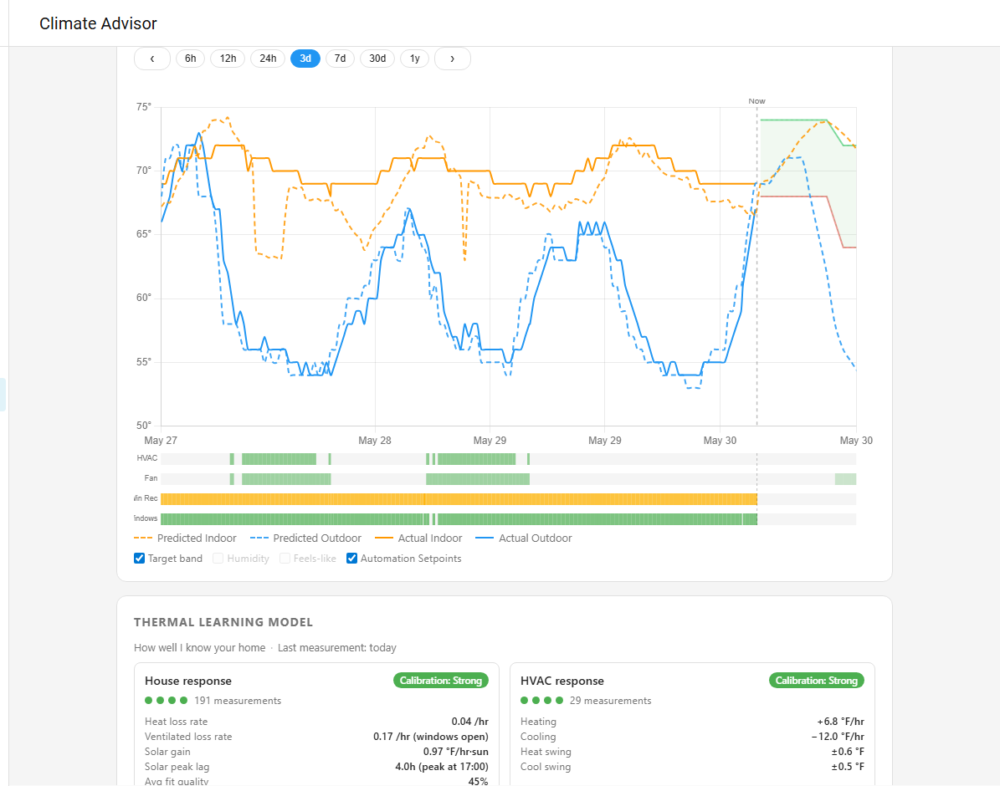
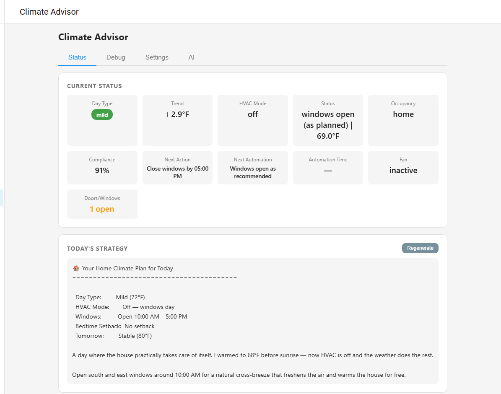
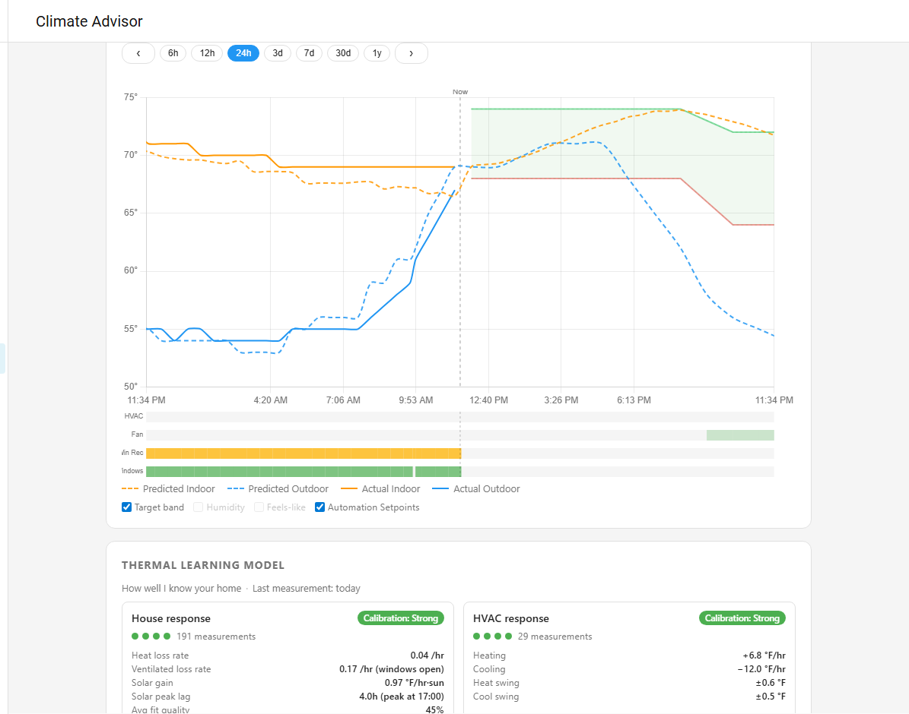
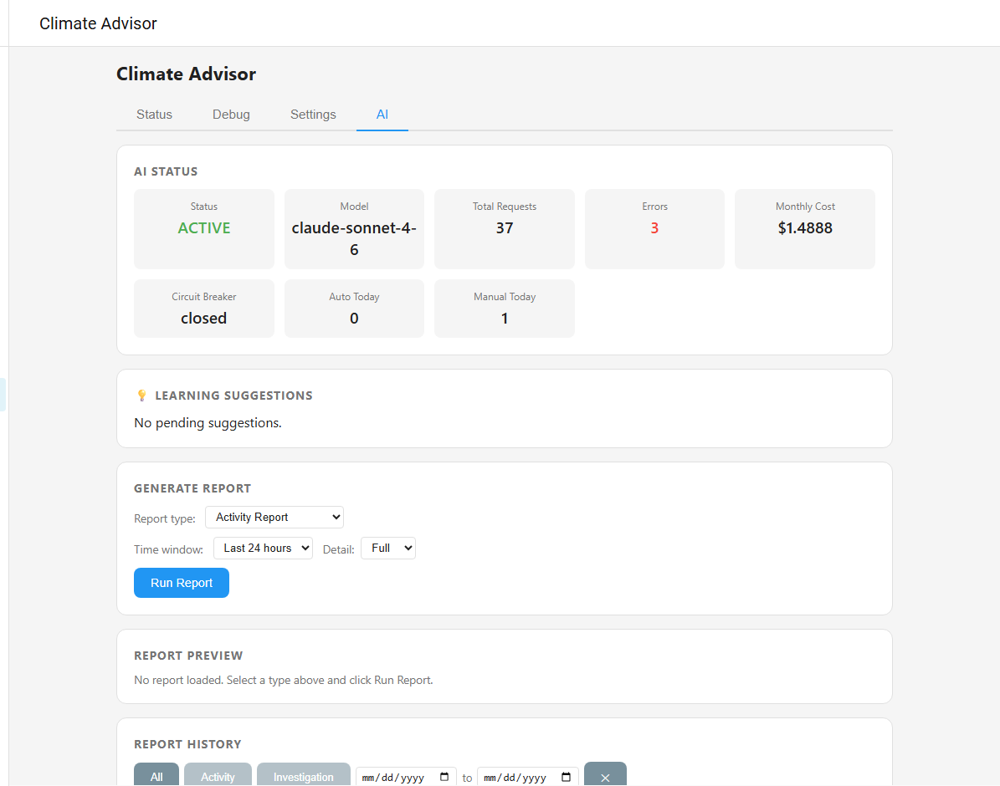

# Climate Advisor for Home Assistant

An intelligent HVAC management integration that uses weather forecasts, occupancy, and door/window sensors to minimize energy waste while keeping your home comfortable — and learns from your household's behavior over time.

**Current version: 0.4.18**

## Dashboard

| Temperature Forecast | Current Status |
|---|---|
|  |  |

| 24-hour View (prediction accuracy) | AI Investigation & Activity Reports |
|---|---|
|  |  |

## Architecture Overview

```
┌──────────────────────────────────────────────────────────────┐
│                      Climate Advisor                         │
│                                                              │
│  ┌─────────────┐   ┌──────────────┐   ┌─────────────┐        │
│  │  Classifier │─▶│  Coordinator │◀──│  Learning   │        │
│  │             │   │   (brain)    │   │  Engine     │        │
│  │ • Day type  │   │              │   │             │        │
│  │ • Trend     │   │ • Scheduling │   │ • Tracking  │        │
│  │ • Forecast  │   │ • Briefings  │   │ • Patterns  │        │
│  │   analysis  │   │ • Events     │   │ • Suggest   │        │
│  └─────────────┘   └──────┬───────┘   └─────────────┘        │
│                           │                                  │
│        ┌──────────┬───────┼───────┬──────────┐               │
│        ▼          ▼       ▼       ▼          ▼               │
│  ┌──────────┐ ┌────────┐ ┌─────┐ ┌────────┐ ┌─────────┐      │
│  │Automation│ │Briefing│ │ API │ │Sensors │ │ State   │      │
│  │ Engine   │ │  Gen   │ │     │ │ (18x)  │ │Persist  │      │
│  │          │ │        │ │22   │ │+ 1     │ │         │      │
│  │• HVAC    │ │• Daily │ │REST │ │switch  │ │• Save / │      │
│  │• Door/win│ │  email │ │end- │ │        │ │  restore│      │
│  │• Occupy  │ │• TLDR  │ │point│ │• Status│ │  across │      │
│  │• Fan ctrl│ │• Tips  │ │s    │ │• Learn │ │  restart│      │
│  │• Econom. │ │        │ │     │ │• Fan   │ │         │      │
│  └──────────┘ └────────┘ └─────┘ └────────┘ └─────────┘      │
└──────────────────────────────────────────────────────────────┘
         │            │         │         │
         ▼            ▼         ▼         ▼
   HA Climate    HA Notify   Dashboard  HA Dashboard
   Entity        Service     Panel      Lovelace Cards
```

## How It Works

### Daily Cycle

1. **6:00 AM** — Coordinator pulls forecast, classifies the day, and sends the daily briefing email/notification
2. **6:30 AM** — Morning warm-up restores comfort setpoint
3. **Throughout the day** — Automation engine responds to doors, windows, occupancy, and temperature changes. CA programs a target comfort band [`comfort_heat` / `comfort_cool`] and the thermostat's own deadband maintains it — every command is a single `heat` or `cool` setpoint, not a dual-setpoint hold.
4. **10:30 PM** — Bedtime setback kicks in
5. **11:59 PM** — Day's data is saved to the learning engine

### Day Types

| Type | Today's High | HVAC Strategy | Human Actions |
|------|-------------|---------------|---------------|
| Hot  | 85°F+       | AC pre-cool, maintain all day | Keep sealed, close blinds |
| Warm | 75–84°F     | Off, AC standby | Open windows morning, close evening |
| Mild | 60–74°F     | Off (heat in AM) | Open windows mid-morning |
| Cool | 45–59°F     | Heat with midday break | Keep closed |
| Cold | Below 45°F  | Heat all day, pre-heat | Keep sealed, help insulate |

### Trend Modifiers

The forecast trend (tomorrow vs. today) adjusts behavior:

- **Warming 10°F+**: More aggressive overnight setback (tomorrow's warmth will help)
- **Warming 5-10°F**: Moderate setback increase
- **Cooling 5-10°F**: Pre-heat in evening, gentler setback
- **Cooling 10°F+**: Significant pre-heat, conservative setback, bank thermal energy

### Occupancy Awareness

Climate Advisor tracks occupancy state via configurable toggle entities:

| Mode | Behavior |
|------|----------|
| Home | Normal operation — full comfort management |
| Away | Setback temperatures applied, notifications reduced |
| Vacation | Extended setback, minimal HVAC activity |
| Guest | Comfort mode — more conservative setbacks |

### Fan Control

Supports whole-house fan and/or HVAC fan mode integration:

- **Whole-house fan**: Controls a dedicated fan entity (switch or fan domain) during economizer maintain phase. While the whole-house fan is active, CA sets the thermostat off so AC and the fan do not run simultaneously; prior mode is restored when the fan stops.
- **HVAC fan mode**: Activates your thermostat's fan-only mode for ventilation
- **Both**: Coordinates both fan types together
- Integrated with the economizer two-phase cooling strategy (cool-down with AC, maintain with ventilation)

### Learning Engine

After 14+ days of data, the learning engine starts analyzing patterns:

- **Window compliance**: If you rarely open windows when recommended, it offers to switch to HVAC-only strategies
- **Manual overrides**: Frequent thermostat adjustments suggest setpoints don't match preferences
- **Runtime anomalies**: High HVAC runtime on mild days may indicate sensor gaps
- **Short departures**: Adapts setback timing if you frequently leave for 30-45 minutes
- **Comfort violations**: Suggests less aggressive setbacks if the house is uncomfortable too often
- **Door pauses**: Identifies problem doors and offers to adjust monitoring

### AI Features

Climate Advisor includes two Claude-powered AI capabilities, each requiring a Claude API key in settings:

**Activity Report** (`ai_enabled`) — analyzes recent system activity and returns a structured report with a timeline, HVAC decision rationale, anomalies, and thermal performance diagnostics. Triggered on demand from the AI tab or via the `climate_advisor.ai_activity_report` service.

**AI Investigator** (`ai_investigator_enabled`) — performs deep cross-source analysis to detect incongruities between the thermal model, pipeline statistics, compliance data, and event log. Returns hypotheses with confidence levels and recommended actions. Results appear in the Investigation panel on the AI tab, where findings can be submitted directly as GitHub issues (requires GitHub token configured under Settings → GitHub Integration).

### Sleep Temperature Configuration

Separate `sleep_heat` and `sleep_cool` setpoints can be configured to define bedtime comfort targets that are distinct from the away setback temperatures. This allows a warmer-than-setback but cooler-than-daytime sleep environment without conflating bedtime comfort with absence setback.

### Natural Ventilation Directional Guard

The natural ventilation directional guard prevents counterproductive ventilation: nat vent activation is blocked when outdoor temperature would move indoor temperature in the wrong direction. A hysteresis band and reactivation lockout prevent rapid cycling. The guard also preserves an active nat vent session through HVAC-off classification events so natural cooling is not prematurely cancelled.

### Thermal Observation Architecture (v3)

The thermal model uses a physics ODE to characterize how the house envelope and HVAC system move indoor temperature over time:

```
dT/dt = (k_passive + k_vent_eff) × (T_out − T_in) + k_solar × solar_factor + Q_hvac
```

Six parallel observation types run concurrently, each targeting a different thermal parameter:

| Observation type | What it measures |
|---|---|
| `hvac_heat` / `hvac_cool` | Active HVAC heating/cooling rate (`k_active_heat`, `k_active_cool`) |
| `passive_decay` | Envelope loss rate without HVAC or ventilation (`k_passive`) |
| `fan_only_decay` | Ventilation effect with fan only (`k_vent`) |
| `ventilated_decay` | Open-window ventilation rate (`k_vent_window`) |
| `solar_gain` | Solar heating contribution (`k_solar`) with learned phase offset |

Parameters are extracted via OLS regression over the full decay or active-phase curve — not from a single start/end delta. Confidence levels (`none` / `low` / `medium` / `high`) are tracked per parameter independently. Physics-based prediction activates when any parameter has confidence above `none`, so homes without HVAC cycles can still benefit from passive decay observations. The predicted indoor curve in the dashboard uses all available parameters.

## Installation

### HACS (Recommended)

1. Open HACS in Home Assistant
2. Click the three dots → Custom repositories
3. Add `https://github.com/gunkl/ClimateAdvisor` as an Integration
4. Search for "Climate Advisor" and install
5. Restart Home Assistant
6. Go to Settings → Integrations → Add Integration → Climate Advisor

### Manual

1. Copy the `custom_components/climate_advisor` folder to your HA `config/custom_components/` directory
2. Restart Home Assistant
3. Go to Settings → Integrations → Add Integration → Climate Advisor

## Configuration

The setup wizard walks you through these steps:

### Step 1: Core Entities
- **Weather Entity**: Your forecast provider (e.g., `weather.home`)
- **Climate Entity**: Your thermostat (e.g., `climate.living_room`)
- **Notification Service**: Where to send briefings (e.g., `notify.mobile_app_phone`)

### Step 2: Temperature Unit
Choose Fahrenheit or Celsius. This setting controls all displayed values and setpoint inputs throughout the integration.

### Step 3: Setpoints
Separate comfort and setback temperatures for heating and cooling, plus optional `sleep_heat` / `sleep_cool` bedtime setpoints.

### Step 4: Temperature Sources
Choose where indoor and outdoor temperature readings come from:
- Weather service (recommended for outdoor)
- Dedicated sensor entity
- Input number helper
- Climate entity fallback (indoor only)

### Step 5: Door/Window Sensors
- Select any binary sensors to monitor (HVAC pauses when open)
- Configure sensor polarity (for inverted sensors)
- Set debounce time (default 5 minutes) and grace periods
- **Fan control**: Choose fan mode (disabled, whole-house fan, HVAC fan, or both) and select fan entity

### Step 6: Occupancy
- Home/away toggle entity (optional)
- Vacation toggle entity (optional)
- Guest toggle entity (optional)
- Polarity inversion for each toggle

### Step 7: Schedule
Set your wake time, bedtime, and when you want the daily briefing.

### Thermostat Setup Requirements

Climate Advisor acts as the scheduler — the thermostat is the executor. For reliable operation, your thermostat must be configured so that CA's commands are held exactly as sent:

1. **Disable built-in schedules and comfort programs** — Turn off any manufacturer-defined schedules, comfort programs, or "Smart Home/Away" features. If the thermostat applies its own schedule after CA sets a setpoint, the physical device will silently revert to its own values even though HA still shows CA's last command.

2. **Set hold type to "Hold until I change"** (indefinite hold) — Many thermostats default to "hold until next scheduled transition," which means the thermostat reverts to its comfort program at the next scheduled event (e.g., 8 am "Home" program). CA issues commands that should persist until CA explicitly changes them. On Ecobee: Settings → Preferences → Hold Action → **Until I change it**.

Without these settings, CA's setpoints will appear to apply momentarily but then be overridden by the thermostat's own schedule, causing the thermostat display and HA's entity state to disagree.

3. **Heating and cooling capability required** — CA issues separate `heat` and `cool` commands (dual-setpoint `heat_cool` mode is not used for thermostat compatibility reasons). The HVAC system must support both heating and cooling. Heat-only or cool-only systems will not receive commands for the unsupported mode and are not a supported configuration.

### Options Flow (Edit After Setup)
All settings are editable after setup, plus advanced options:
- **Learning enabled**: Toggle the learning engine on/off
- **Aggressive savings**: More aggressive energy-saving strategies
- **AI Investigator**: Enable Claude-powered activity analysis; requires a Claude API key
- **GitHub Integration**: Configure a GitHub personal access token and repository for submitting investigation reports as GitHub issues directly from the dashboard

## Entities Created

### Sensors (18)

| Sensor | Description |
|--------|-------------|
| `sensor.climate_advisor_day_type` | Today's classification (hot/warm/mild/cool/cold) |
| `sensor.climate_advisor_trend` | Temperature trend direction and magnitude |
| `sensor.climate_advisor_next_action` | Next recommended human action |
| `sensor.climate_advisor_daily_briefing` | Today's briefing TLDR (full text in attributes) |
| `sensor.climate_advisor_comfort_score` | Comfort compliance percentage |
| `sensor.climate_advisor_status` | Integration status (active/grace/override/paused) |
| `sensor.climate_advisor_next_automation` | Next scheduled automation action |
| `sensor.climate_advisor_next_automation_time` | When the next automation runs |
| `sensor.climate_advisor_occupancy` | Current occupancy mode (home/away/vacation/guest) |
| `sensor.climate_advisor_last_action_time` | Timestamp of last HVAC action |
| `sensor.climate_advisor_last_action_reason` | Why the last HVAC action was taken |
| `sensor.climate_advisor_fan_status` | Fan status: `active`, `running (manual override)`, `running (untracked)`, `inactive`, `off (manual override)`, `disabled`; attributes include `fan_override_since` and `fan_running` |
| `sensor.climate_advisor_contact_status` | Door/window sensor summary with per-sensor details |
| `sensor.climate_advisor_ai_status` | AI feature status (enabled/disabled, model, request counts, monthly cost) |
| `sensor.climate_advisor_indoor_temperature` | Current indoor temperature (mirrors climate entity) |
| `sensor.climate_advisor_outdoor_temperature` | Current outdoor temperature from configured source |
| `sensor.climate_advisor_forecast_high` | Today's forecast high temperature |
| `sensor.climate_advisor_forecast_low` | Today's forecast low temperature |

### Switches (1)

| Switch | Description |
|--------|-------------|
| `switch.climate_advisor_automation` | Enable/disable automation (observe-only mode when off) |

## Services

### `climate_advisor.respond_to_suggestion`

Accept or dismiss a learning suggestion.

```yaml
service: climate_advisor.respond_to_suggestion
data:
  action: accept  # or "dismiss"
  suggestion_key: low_window_compliance
```

### `climate_advisor.force_reclassify`

Force re-fetch of forecast data and reclassify the day. Useful for debugging.

```yaml
service: climate_advisor.force_reclassify
```

### `climate_advisor.resend_briefing`

Re-generate and resend the daily briefing notification.

```yaml
service: climate_advisor.resend_briefing
```

### `climate_advisor.dump_diagnostics`

Log a comprehensive diagnostic snapshot to HA logs at INFO level for troubleshooting.

```yaml
service: climate_advisor.dump_diagnostics
```

### `climate_advisor.ai_activity_report`

Trigger an on-demand AI activity report analysis. Requires AI Investigator to be enabled and a Claude API key configured.

```yaml
service: climate_advisor.ai_activity_report
```

### `climate_advisor.get_ai_report`

Retrieve the most recent AI activity report.

```yaml
service: climate_advisor.get_ai_report
```

### `climate_advisor.clear_ai_reports`

Clear persisted AI report history.

```yaml
service: climate_advisor.clear_ai_reports
```

## Dashboard

Climate Advisor includes a built-in dashboard panel accessible from the HA sidebar. The panel provides:

- **Current Status** — Day type, HVAC mode, setpoint, indoor temp, automation status, contact sensor states, fan status
- **Daily Briefing** — Full briefing with TLDR summary table, verbosity control (tldr_only/normal/verbose)
- **Classification Details** — Forecast data, window schedules, trend analysis
- **Learning** — Today's record, suggestions, compliance tracking
- **AI Investigator** — Claude-powered activity report with timeline, HVAC decisions, anomalies, and diagnostics (requires API key)
- **Settings** — Read-only view of all configuration grouped by category
- **Debug** — Automation state, force reclassify, resend briefing, diagnostics dump

### REST API Endpoints

The dashboard is powered by 22 REST API endpoints under `/api/climate_advisor/`:

| Endpoint | Method | Description |
|----------|--------|-------------|
| `/status` | GET | Current state overview |
| `/briefing` | GET | Briefing text (supports `?verbosity=` param) |
| `/chart_data` | GET | Temperature chart data (supports `?before_ts=` for historical navigation) |
| `/automation_state` | GET | Automation engine debug state |
| `/learning` | GET | Learning records and suggestions |
| `/config` | GET | All settings with metadata |
| `/ai_status` | GET | AI feature status, model, request counts, and cost |
| `/ai_activity` | GET/POST | Trigger or retrieve activity report |
| `/ai_reports` | GET | Persisted activity report history |
| `/ai_investigate` | POST | Trigger deep investigator analysis |
| `/investigation_reports` | GET | Persisted investigation report history |
| `/engines` | GET | Prediction engine status and thermal model parameters |
| `/event_log` | GET | Recent automation events ring buffer |
| `/force_reclassify` | POST | Trigger reclassification |
| `/send_briefing` | POST | Resend daily briefing |
| `/respond_suggestion` | POST | Accept/dismiss a suggestion |
| `/cancel_override` | POST | Cancel manual override |
| `/cancel_fan_override` | POST | Cancel fan manual override |
| `/resume_from_pause` | POST | Resume from contact sensor pause |
| `/toggle_automation` | POST | Toggle automation on/off |
| `/delete_report` | POST | Delete a persisted AI report |
| `/submit_github_issue` | POST | Submit investigation findings as a GitHub issue (requires token) |

### Lovelace Card Example

```yaml
type: entities
title: Climate Advisor
entities:
  - entity: sensor.climate_advisor_day_type
    name: Today's Plan
  - entity: sensor.climate_advisor_trend
    name: Trend
  - entity: sensor.climate_advisor_next_action
    name: Your Next Action
  - entity: sensor.climate_advisor_next_automation
    name: Next Automation
  - entity: sensor.climate_advisor_comfort_score
    name: Comfort Score
  - entity: sensor.climate_advisor_contact_status
    name: Doors/Windows
  - entity: sensor.climate_advisor_fan_status
    name: Fan
  - entity: sensor.climate_advisor_occupancy
    name: Occupancy
  - entity: switch.climate_advisor_automation
    name: Automation Enabled
  - entity: sensor.climate_advisor_status
    name: System Status
```

## Development Roadmap

See [Issue #11](https://github.com/gunkl/ClimateAdvisor/issues/11) for full tracking.

### Phase 1: Core (v0.1.0) — Complete
- [x] 5-level day type classification with trend analysis
- [x] Daily briefing as primary UI (email/notification)
- [x] Door/window pause automation with grace periods
- [x] Occupancy-based setback with configurable delay
- [x] Bedtime/morning scheduling with forecast-aware adjustments
- [x] Runaway protection (runtime alerts, daily budgets)
- [x] Learning engine foundation (90-day rolling window, 6 pattern detectors)
- [x] Config flow wizard, HA sensor entities, dashboard API
- [x] Flexible temperature source configuration
- [x] Separate comfort/setback temps for heat and cool modes

### Phase 2: Enhanced Learning & Adaptation (v0.2.x) — Complete
- [x] Persist operational state across restarts (#10)
- [x] Populate DailyRecord fields (runtime, avg temp, comfort violations, window compliance)
- [x] Per-sensor pause tracking and granular daily records (#12)
- [x] Override direction/timing/magnitude analysis (#12)
- [x] Built-in dashboard panel with status, briefing, classification, learning, settings, and debug tabs
- [x] REST API endpoints powering the dashboard (now 22)
- [x] Sensor entities + 1 automation switch (now 18 sensors)
- [x] Observe-only mode (disable automation without uninstalling) (#19)
- [x] Economizer two-phase cooling strategy (AC cool-down, ventilation maintain) (#27)
- [x] Whole-house fan and HVAC fan mode support (#25)
- [x] Occupancy awareness with home/away/vacation/guest modes
- [x] Briefing TLDR summary table with verbosity control (#24)
- [x] Contact sensor status surfaced in dashboard and as HA entity (#46)
- [x] Resume from pause control with grace expiry re-check (#47)
- [x] Cancel manual override from dashboard
- [x] Reason logging on all thermostat adjustments (#16)
- [x] Repairs flow for missing weather entity
- [x] 4 HA services (respond to suggestion, force reclassify, resend briefing, dump diagnostics)
- [x] 250-char notification limit for short notifications (#21)
- [x] Startup race condition handling for weather entity (#36)

### Phase 2.5: Thermal Learning & AI Investigator (v0.3.24–v0.3.54) — Shipped
- [x] Thermal model v2: two-parameter physics ODE (`k_passive` + `k_active_heat`/`k_active_cool`) replacing scalar rate model (#114)
- [x] `PendingThermalEvent` state machine with post-heat decay curve OLS regression
- [x] Pending thermal event persisted across HA restarts
- [x] Optimized pre-heat/pre-cool timing and setback depth based on thermal performance
- [x] Claude API client with circuit breaker, retry, rate limiting, and budget tracking (`claude_api.py`)
- [x] AI skills framework — pluggable registry for AI analysis capabilities (`ai_skills.py`)
- [x] AI Activity Report: timeline, HVAC decisions, anomalies, diagnostics (`ai_skills_activity.py`)
- [x] Persistent 1-year chart log ring buffer for temperature/HVAC/fan/event data (`chart_log.py`)
- [x] Sleep temperature setpoints (`sleep_heat` / `sleep_cool`) distinct from away setback
- [x] Natural ventilation directional guard with hysteresis and reactivation lockout (#115)
- [x] Dynamic Target Band: chart shows actual system targets (comfort/sleep/setback/vacation) (#119)
- [x] Thermal model v3: six parallel observation types (`hvac_heat`, `hvac_cool`, `passive_decay`, `fan_only_decay`, `ventilated_decay`, `solar_gain`); extended ODE with k_vent and k_solar terms; `k_passive` collectable without HVAC cycles (#121)
- [x] Dual-estimator framework for `k_passive` and `k_vent_window` (block-OLS + chart_log endpoint) (#146)
- [x] Solar phase offset learning via chart_log daytime passive windows (#147)
- [x] Chart historical navigation with before_ts anchor parameter (#160)
- [x] Chart forward navigation into physics-simulated predicted future (#164)
- [x] AI Investigation Analysis: unified view, report history, feedback buttons (#166)
- [x] AI Investigator: deep cross-source analysis with KNOWN_FIXES registry, hypothesis generation (#177 noise reduction)
- [x] GitHub issue submission from investigation panel with config flow GitHub Integration step (#180)
- [x] Setpoint-only manual overrides enter manual grace period immediately (#170)
- [x] DailyRecord accumulated counters survive HA restart (#176)
- [x] Predicted indoor evening drop fixed: ODE mode uses classification for today (#172)

### Phase 3: Thermostat-as-Controller & Compatibility (v0.4.x) — Current
- [x] Comfort band model — CA programs `[comfort_heat / comfort_cool]` and the thermostat holds it; HVAC is no longer micromanaged every 30 min (#249)
- [x] Single-setpoint commands — every thermostat write is `climate.set_temperature` with mode + setpoint; `heat_cool` dual-setpoint mode dropped for compatibility (#301)
- [x] Whole-house fan suppresses HVAC while active (#277)
- [x] Override detection overhaul — clean-slate on restart, grace expiry notification, transient override detection (#282, #290)
- [x] Ecobee deduplication bypass — double-write ensures commands reach the physical thermostat (#299)
- [x] Pre-cool gate — ceiling reverts after target achieved, no overcooling (#295)
- [x] `k_solar` confidence ladder (`none` / `low` / `medium` / `high`, graded by observation count) (#308)
- [x] Solar phase offset daily re-fit from chart_log passive windows (#310)
- [x] AC duty solar phase estimator — secondary EWMA for homes with summer-only AC (#312)
- [x] Fan command suppression of false overrides; 30s post-fan setpoint verify (#313)
- [x] Sleep setpoint ordering fix — sleep temps independent of daytime comfort bounds (#318)
- [x] Pause state not persisted across restarts — clean-slate after HA restart (#263)

### Phase 4: Seasonal & Cost Intelligence (v0.5+) — Future
- [ ] Seasonal performance baselines (after 1 year of data)
- [ ] Anomaly detection (e.g., "heating 30% higher than last November")
- [ ] Energy cost integration (utility rates → estimated cost)
- [ ] Savings tracking vs. "no automation" baseline

### Phase 5: Multi-Zone & Advanced (v0.6+) — Future
- [ ] Multi-zone HVAC support (multiple thermostats)
- [ ] Room-level occupancy detection
- [ ] Humidity-based decisions
- [ ] Energy source cost optimization
- [ ] Advanced thermal model with per-zone coefficients

## Contributing

1. Fork the repository
2. Create a feature branch
3. Make your changes
4. Test with a Home Assistant dev environment
5. Submit a pull request

## File Structure

```
custom_components/climate_advisor/
├── __init__.py          # Integration setup, service registration
├── manifest.json        # HA integration metadata
├── const.py             # Constants, thresholds, defaults
├── config_flow.py       # Setup wizard UI (7-step flow + options)
├── strings.json         # UI text for config flow
├── translations/
│   └── en.json          # English translations
├── coordinator.py       # Central brain — scheduling, events, data flow
├── classifier.py        # Day type and trend classification
├── briefing.py          # Daily briefing text generation
├── automation.py        # HVAC control logic (incl. economizer, fan)
├── learning.py          # Pattern tracking and suggestion engine
├── sensor.py            # 18 HA sensor entities for dashboards
├── switch.py            # Automation enable/disable switch
├── api.py               # 22 REST API endpoints for dashboard panel
├── state.py             # State persistence across restarts
├── repairs.py           # HA repairs flow for config issues
├── claude_api.py        # Claude API client: auth, retry, circuit breaker, rate limiting, budget tracking
├── ai_skills.py         # Lightweight skill registry framework for pluggable AI capabilities
├── ai_skills_activity.py  # Activity Report skill (AI Investigator): timeline, decisions, anomalies, diagnostics
├── chart_log.py         # Persistent 1-year ring buffer of HVAC/fan/temperature data + event markers
├── services.yaml        # Service definitions
├── frontend/
│   └── index.html       # Built-in dashboard panel
├── brand/               # Integration branding assets
├── icon.png             # Integration icon
└── icon@2x.png          # Retina integration icon
```

## License

MIT
