<!-- Nav: ← [Architecture Reference](02-ARCHITECTURE-REFERENCE.md) → [Computation Reference](08-COMPUTATION-REFERENCE.md) -->

# Climate Advisor — Automation Flowcharts

This document provides visual decision-path references for every major control flow in the Climate Advisor automation engine. Each diagram reflects the actual source code logic in `coordinator.py`, `automation.py`, and `classifier.py`.

For data structures and coordinator internals see [docs/02-ARCHITECTURE-REFERENCE.md](02-ARCHITECTURE-REFERENCE.md).
For temperature formulas and threshold values see [docs/08-COMPUTATION-REFERENCE.md](08-COMPUTATION-REFERENCE.md).

---

## Anchors
| Question | Short answer | → Full answer |
|---|---|---|
| What gate conditions can block the 30-minute poll from applying a classification? | Two gates: `_manual_override_active` (user changed thermostat) and `_first_run` with HVAC already running (treated as manual override). Both cause `apply_classification()` to skip the HVAC mode change. | [§1. Main Decision Loop](07-AUTOMATION-FLOWCHART.md#1-main-decision-loop-30-minute-poll) |
| How does the door/window pause flow work from sensor open to HVAC off? | Sensor open → debounce timer (default 5 min) → verify still open → check grace, planned window period → **check nat-vent first** (if outdoor cooler than indoor, fan on, band stays armed, no shutoff) → if nat-vent gates fail: set `_hvac_command_pending` → HVAC off + notification. | [§4. Door/Window Pause Flow](07-AUTOMATION-FLOWCHART.md#4-doorwindow-pause-flow) |
| When a grace period expires, what prevents it from blindly restoring HVAC? | `_grace_expired()` calls `_re_pause_for_open_sensor()`, which checks `_is_within_planned_window_period()` before re-pausing — sensors open in a recommended window period are not re-paused. | [§4b. Grace Expiry with Planned Window Period Check](07-AUTOMATION-FLOWCHART.md#4b-grace-expiry-with-planned-window-period-check) |
| How does manual override protection work — what sets it and what clears it? | `_async_thermostat_changed()` detects mode changes not preceded by `_hvac_command_pending`; starts a **10-min confirmation window** (`_override_confirm_pending = True`). If thermostat is still divergent after the window (PATH A), sets `_manual_override_active = True` and starts grace. If it self-reverted (PATH B), no grace. Cleared at wakeup or bedtime schedule boundary. | [§5. Manual Override Protection](07-AUTOMATION-FLOWCHART.md#5-manual-override-protection) |
| What are the natural ventilation exit conditions and in what order are they checked? | Priority order: **1** all sensors closed → **2** comfort floor exit (sleep-aware: `sleep_heat - hysteresis` during the sleep window, `comfort_heat` otherwise, Issue #402) → **3** away-mode ceiling exit → **4** proactive floor exit (thermal-model prediction) → **5** outdoor-rise exit (outdoor ≥ indoor) → **6** ceiling threshold exit (outdoor > comfort_cool + delta). First match wins. During the sleep window, session-continuation cycling is handled separately by `nat_vent_temperature_check()` (fan off at `sleep_heat`, on at `sleep_heat + 2×hysteresis`) — the old "Priority 0 sleep-ceiling reached" exit was removed in Issue #371 and is not part of the current design. | [§12b. Continuous Monitoring](07-AUTOMATION-FLOWCHART.md#12b-continuous-monitoring-check_natural_vent_conditions) |
| What HVAC state does `_apply_nat_vent_hvac_state()` arm when nat-vent activates, and how does `aggressive_savings` change it? | `FAN_MODE_HVAC` + `aggressive_savings=False` → full comfort band `[comfort_heat, comfort_cool]` (compressor can assist if breeze can't hold ceiling). `FAN_MODE_HVAC` + `aggressive_savings=True` → heat-only at `comfort_heat` (floor protected, ceiling disarmed — no compressor through open windows). `WHOLE_HOUSE` or `DISABLED` → no-op. | [§12c. Nat-Vent HVAC State](07-AUTOMATION-FLOWCHART.md#12c-nat-vent-hvac-state--_apply_nat_vent_hvac_state) |
| How does occupancy priority resolve when multiple toggles are active? | Guest > Vacation > Home/Away > default (home). `_compute_occupancy_mode()` in the coordinator reads all three toggle states and dispatches to the matching handler. | [§9. Occupancy State Machine](07-AUTOMATION-FLOWCHART.md#9-occupancy-state-machine) |
| Where is the full Tier 3 spec for grace periods — state transitions, timer lifecycle, invariants, HA-restart behavior? | The Territory spec covers both grace types, the 12-row transition table, pre-pause mode storage/restoration, occupancy interaction, and error conditions including sensor-unavailable-during-pause. | [Grace Period State Machine — Territory Spec](grace-periods-spec.md) |
| Where is the full Tier 3 spec for the occupancy dispatch state machine — priority, handlers, setback formulas, persistence? | The Territory spec covers priority resolution (GUEST > VACATION > HOME/AWAY), all four toggle-entity handlers, the 7-row state transition table, setback formula derivation, and the interaction with manual override and grace periods. | [Occupancy Dispatch State Machine — Territory Spec](occupancy-dispatch-spec.md) |
| What is the decision sequence inside apply_classification() for a warm or mild day, and when does the ODE ceiling guard fire? | Two sequential guards run before the HVAC-off action: (1) comfort-floor guard fires if indoor < comfort_heat; (2) ODE ceiling guard fires if a predicted breach is within the computed lead time and outdoor > indoor. Stateless — re-evaluated every 30-min cycle. | [§13. Warm-Day apply_classification() Guard Sequence](07-AUTOMATION-FLOWCHART.md#13-warm-day-apply_classification-guard-sequence) |
| What are the early-return gates inside apply_classification() and in what order do they run? | Five gates run before comfort-band logic: (1) manual_override_active, (2) override_confirm_pending, (3) first-run HVAC running, (4) occupancy AWAY/VACATION redirect, (5) _paused_by_door — forces HVAC off and returns without applying the comfort band. | [§4c. apply_classification() Gate Sequence](07-AUTOMATION-FLOWCHART.md#4c-apply_classification-gate-sequence) |
| What decision does the startup coalesce make for a physically running fan, and what triggers the thermostatic fast loop? | Coalesce reads live thermostat `fan_mode`/`hvac_action` and chooses adopt-on (nat-vent eligible), turn-off, or no-fan. The thermostatic loop fires on every indoor or outdoor temp change (two new listeners + backstop timer), not only on 30-min polls. | [§14. Fan Startup Reconciliation and Thermostatic Loop (Issue #327)](07-AUTOMATION-FLOWCHART.md#14-fan-startup-reconciliation-and-thermostatic-loop-issue-327) |
| How does `_apply_nat_vent_hvac_state()` decide whether to arm the full comfort band or floor-only when nat-vent activates? | `FAN_MODE_WHOLE_HOUSE`/`DISABLED` → no-op; `FAN_MODE_HVAC` + `aggressive_savings=False` → full band `[comfort_heat, comfort_cool]` (AC assists if breeze fails); `FAN_MODE_HVAC` + `aggressive_savings=True` → floor-only (heat @ `comfort_heat`, ceiling disarmed — no compressor through open windows). | [§12c. Nat-Vent HVAC State — `_apply_nat_vent_hvac_state()`](07-AUTOMATION-FLOWCHART.md#12c-nat-vent-hvac-state--_apply_nat_vent_hvac_state) |

## 1. Main Decision Loop (30-Minute Poll)

`_async_update_data()` runs every 30 minutes via `DataUpdateCoordinator`.

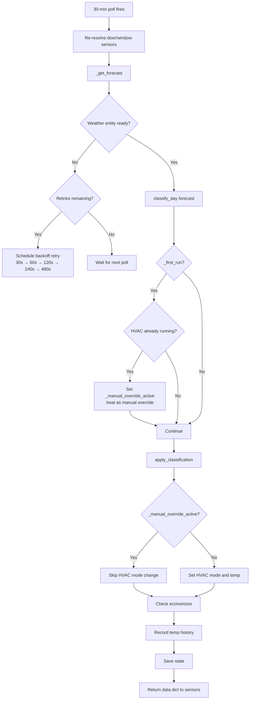
```mermaid
graph TD
    A[30-min poll fires] --> B[Re-resolve door/window sensors]
    B --> C[_get_forecast]
    C --> D{Weather entity ready?}
    D -->|No| E{Retries remaining?}
    E -->|Yes| F[Schedule backoff retry\n30s → 60s → 120s → 240s → 480s]
    E -->|No| G[Wait for next poll]
    D -->|Yes| H[classify_day forecast]
    H --> I{_first_run?}
    I -->|Yes| J{HVAC already running?}
    J -->|Yes| K[Set _manual_override_active\ntreat as manual override]
    J -->|No| L[Continue]
    I -->|No| L
    K --> L
    L --> M[apply_classification]
    M --> N{_manual_override_active?}
    N -->|Yes| O[Skip HVAC mode change]
    N -->|No| P[Set HVAC mode and temp]
    O --> Q[Check economizer]
    P --> Q
    Q --> R[Record temp history]
    R --> S[Save state]
    S --> T[Return data dict to sensors]
```

---

## 2. Classification Pipeline

`classify_day()` in `classifier.py` takes a `ForecastSnapshot` and returns a `DayClassification`.

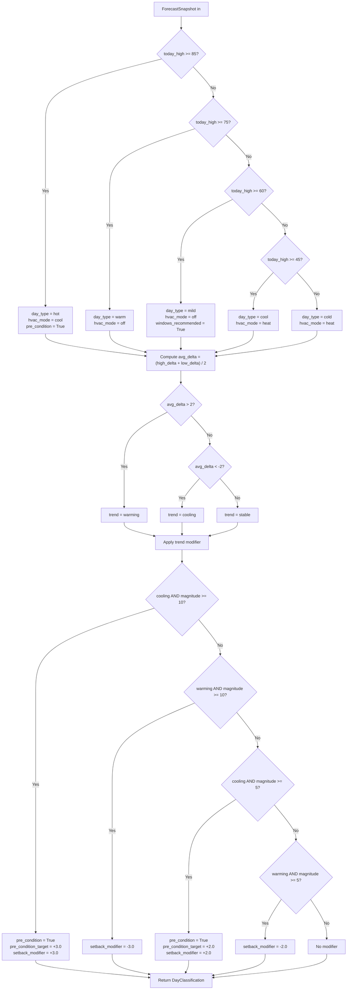
```mermaid
graph TD
    A[ForecastSnapshot in] --> B{today_high >= 85?}
    B -->|Yes| C[day_type = hot\nhvac_mode = cool\npre_condition = True]
    B -->|No| D{today_high >= 75?}
    D -->|Yes| E[day_type = warm\nhvac_mode = off]
    D -->|No| F{today_high >= 60?}
    F -->|Yes| G[day_type = mild\nhvac_mode = off\nwindows_recommended = True]
    F -->|No| H{today_high >= 45?}
    H -->|Yes| I[day_type = cool\nhvac_mode = heat]
    H -->|No| J[day_type = cold\nhvac_mode = heat]
    C --> K["Compute avg_delta = (high_delta + low_delta) / 2"]
    E --> K
    G --> K
    I --> K
    J --> K
    K --> L{avg_delta > 2?}
    L -->|Yes| M[trend = warming]
    L -->|No| N{avg_delta < -2?}
    N -->|Yes| O[trend = cooling]
    N -->|No| P[trend = stable]
    M --> Q[Apply trend modifier]
    O --> Q
    P --> Q
    Q --> R{cooling AND magnitude >= 10?}
    R -->|Yes| S[pre_condition = True\npre_condition_target = +3.0\nsetback_modifier = +3.0]
    R -->|No| T{warming AND magnitude >= 10?}
    T -->|Yes| U[setback_modifier = -3.0]
    T -->|No| V{cooling AND magnitude >= 5?}
    V -->|Yes| W[pre_condition = True\npre_condition_target = +2.0\nsetback_modifier = +2.0]
    V -->|No| X{warming AND magnitude >= 5?}
    X -->|Yes| Y[setback_modifier = -2.0]
    X -->|No| Z[No modifier]
    S --> AA[Return DayClassification]
    U --> AA
    W --> AA
    Y --> AA
    Z --> AA
```

---

## 3. Daily Schedule

Four scheduled events fire each day via `async_track_time_change`.

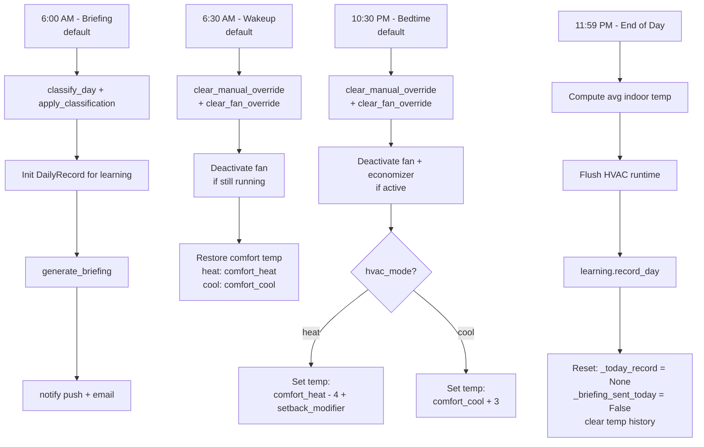
```mermaid
graph TD
    A[6:00 AM - Briefing\ndefault] --> B[classify_day + apply_classification]
    B --> C[Init DailyRecord for learning]
    C --> D[generate_briefing]
    D --> E[notify push + email]

    F[6:30 AM - Wakeup\ndefault] --> G[clear_manual_override\n+ clear_fan_override]
    G --> H[Deactivate fan\nif still running]
    H --> HH[Restore comfort temp\nheat: comfort_heat\ncool: comfort_cool]

    I[10:30 PM - Bedtime\ndefault] --> J[clear_manual_override\n+ clear_fan_override]
    J --> JJ[Deactivate fan + economizer\nif active]
    JJ --> K{hvac_mode?}
    K -->|heat| L[Set temp:\ncomfort_heat - 4 + setback_modifier]
    K -->|cool| M[Set temp:\ncomfort_cool + 3]

    N[11:59 PM - End of Day] --> O[Compute avg indoor temp]
    O --> P[Flush HVAC runtime]
    P --> Q[learning.record_day]
    Q --> R[Reset: _today_record = None\n_briefing_sent_today = False\nclear temp history]
```

---

## 4. Door/Window Pause Flow

Sensor state changes are handled by `_async_door_window_changed()` in the coordinator, with pause logic in `handle_door_window_open()` and `handle_all_doors_windows_closed()` in the automation engine.

When the system sets HVAC to `off` as part of a pause, it sets `_hvac_command_pending = True` and records `_hvac_command_time` before issuing the service call. This tells the thermostat state change handler (Section 5) that the mode change is system-initiated, not a user action, preventing false manual override detection.

**Nat-vent runs before pause.** After the debounce expires, `handle_door_window_open()` checks natural ventilation conditions first (`outdoor < indoor AND indoor > comfort_heat AND outdoor < comfort_cool + delta`). If met, the fan turns on and the comfort band stays armed (Issue #249) — HVAC is NOT set to off and `_paused_by_door` is NOT set. The HVAC-off pause is only the fallback when nat-vent gates fail.

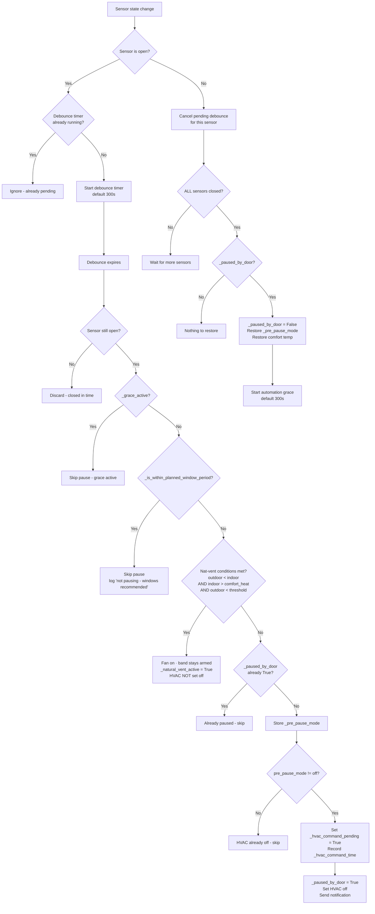
```mermaid
graph TD
    A[Sensor state change] --> B{Sensor is open?}
    B -->|Yes| C{Debounce timer\nalready running?}
    C -->|Yes| D[Ignore - already pending]
    C -->|No| E[Start debounce timer\ndefault 300s]
    E --> F[Debounce expires]
    F --> G{Sensor still open?}
    G -->|No| H[Discard - closed in time]
    G -->|Yes| I{_grace_active?}
    I -->|Yes| J[Skip pause - grace active]
    I -->|No| K{_is_within_planned_window_period?}
    K -->|Yes| L[Skip pause\nlog 'not pausing - windows recommended']
    K -->|No| NV{Nat-vent conditions met?\noutdoor < indoor\nAND indoor > comfort_heat\nAND outdoor < threshold}
    NV -->|Yes| NVA[Fan on · band stays armed\n_natural_vent_active = True\nHVAC NOT set off]
    NV -->|No| M{_paused_by_door\nalready True?}
    M -->|Yes| N[Already paused - skip]
    M -->|No| O[Store _pre_pause_mode]
    O --> P{pre_pause_mode != off?}
    P -->|No| Q[HVAC already off - skip]
    P -->|Yes| R[Set _hvac_command_pending = True\nRecord _hvac_command_time]
    R --> S[_paused_by_door = True\nSet HVAC off\nSend notification]
    B -->|No| T[Cancel pending debounce\nfor this sensor]
    T --> U{ALL sensors closed?}
    U -->|No| V[Wait for more sensors]
    U -->|Yes| W{_paused_by_door?}
    W -->|No| X[Nothing to restore]
    W -->|Yes| Y[_paused_by_door = False\nRestore _pre_pause_mode\nRestore comfort temp]
    Y --> Z[Start automation grace\ndefault 300s]
```

### 4b. Grace Expiry with Planned Window Period Check

When a grace period expires and a sensor is still open, `_grace_expired()` calls `_re_pause_for_open_sensor()`. Before re-pausing, the system first checks whether the open sensor is expected (i.e., within the planned window period for the current classification).

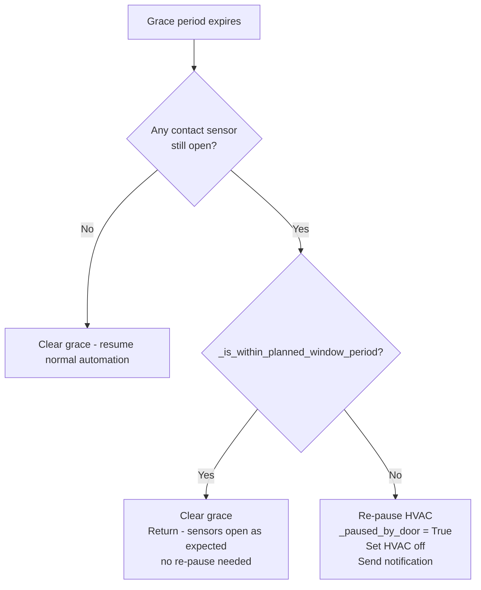
```mermaid
graph TD
    A[Grace period expires] --> B{Any contact sensor\nstill open?}
    B -->|No| C[Clear grace - resume normal automation]
    B -->|Yes| D{_is_within_planned_window_period?}
    D -->|Yes| E[Clear grace\nReturn - sensors open as expected\nno re-pause needed]
    D -->|No| F[Re-pause HVAC\n_paused_by_door = True\nSet HVAC off\nSend notification]
```

**Key behavior:** The planned window period check in the grace expiry path prevents an annoying cycle where the system resumes HVAC after a grace period, immediately re-pauses because a window is still open, and then sends a duplicate notification — all during the time window when open windows are the intended state.

### 4a. Resume from Pause (User Action)

Users can click **"Resume HVAC (override pause)"** in the Door/Window Sensors section of the Debug tab. This action is treated as a manual override.

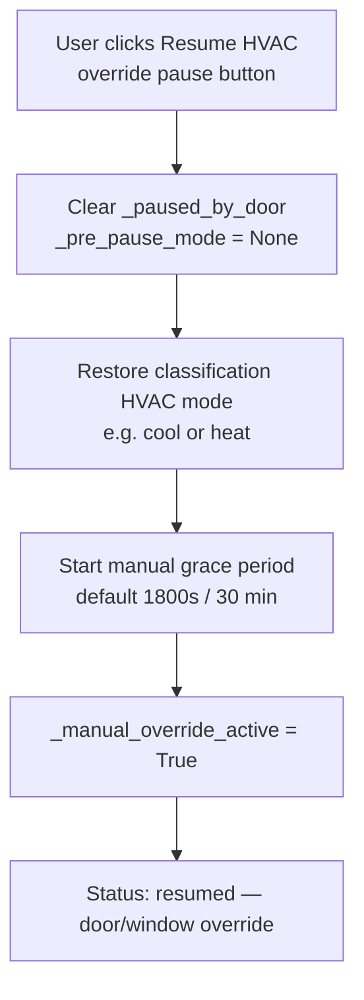
```mermaid
graph TD
    A[User clicks Resume HVAC\noverride pause button] --> B[Clear _paused_by_door\n_pre_pause_mode = None]
    B --> C[Restore classification HVAC mode\ne.g. cool or heat]
    C --> D[Start manual grace period\ndefault 1800s / 30 min]
    D --> E[_manual_override_active = True]
    E --> F[Status: resumed — door/window override]
```

**Key behaviors:**
- Restores the current day classification's recommended HVAC mode (e.g. `cool` on a hot day), not a previously stored state.
- Starts a full manual override grace period (default 30 min). During this window, new contact sensor open events cannot re-pause HVAC.
- IS recorded as a manual override — `apply_classification` will skip HVAC mode changes until the grace expires or a schedule boundary clears it.
- Status string `"resumed — door/window override"` is surfaced in the Current Status pane and sensor entity.

### 4c. apply_classification() Gate Sequence

`apply_classification()` evaluates five early-return gates before it touches the thermostat. Gates 1–4 existed before fix #337; Gate 5 was added by fix #337.

| Gate | Condition | Action |
|---|---|---|
| 1 | `_manual_override_active` | Skip all HVAC changes — return |
| 2 | `_override_confirm_pending` | Skip — waiting for user confirmation |
| 3 | First-run AND HVAC already running | Treat as manual override — return |
| 4 | Occupancy is AWAY or VACATION | Redirect to setback handler — return |
| **5** | **`_paused_by_door` is True** | **Force HVAC off (if not already off), emit `classification_suppressed_paused`, return — no comfort band applied** |
| — | All gates pass | Apply comfort band and day-type HVAC mode |

**Gate 5 detail (fix #337):** When windows or doors are open and the system is paused, the 30-minute classification cycle previously did nothing — meaning a classification scheduled while the system was already paused could restore comfort temps or change HVAC mode on the next cycle. Gate 5 closes this gap: every 30-minute poll enforces the off state while `_paused_by_door=True`, regardless of day type (hot, cold, mild, warm) and regardless of which path set the flag (direct door sensor open vs. nat-vent exit). If the thermostat is already off, no service call is made. The `classification_suppressed_paused` event is emitted so the coordinator can log and surface the suppression reason.

### 4d. Occupancy Change While Paused (Fix #339)

When occupancy switches to `away` or `vacation` while `_paused_by_door=True` (a door or window is open), the setback band is suppressed. The handlers behave as follows:

- `_occupancy_mode` **is** updated immediately — the new occupancy state is recorded.
- No setback band service call is made — the thermostat is left at HVAC off (the existing paused state).
- Event `occupancy_setback_suppressed_paused` is emitted with payload `{occupancy: "away"|"vacation", reason: "paused_by_door"}`.
- The coordinator status string reflects both states: `"paused — away (setback deferred: windows open)"` or `"paused — vacation (setback deferred: windows open)"`.
- When sensors eventually close, the resume path calls `_set_temperature_for_mode()`, whose §6a safety net redirects to `handle_occupancy_away()` or `handle_occupancy_vacation()` as appropriate — the deferred setback is applied at that point.

**Why:** Applying a setback band while HVAC is paused for open sensors would re-arm the thermostat in a mode that conflicts with the pause reason. The occupancy state is captured so the correct setback is applied the moment the sensors close and the system resumes.

---

## 5. Manual Override Protection

Thermostat state changes are monitored by `_async_thermostat_changed()` in the coordinator.

The `_hvac_command_pending` flag and `_hvac_command_time` timestamp are set by the system before it issues any HVAC service call (pause, resume, classification apply, etc.). When the thermostat state change event arrives, the handler checks this flag first. If it is set, the change is system-initiated and no override is recorded.

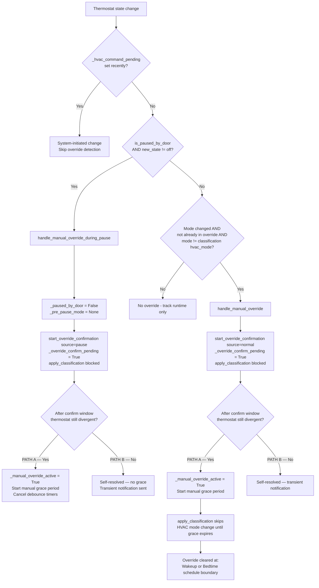
```mermaid
graph TD
    A[Thermostat state change] --> AA{_hvac_command_pending\nset recently?}
    AA -->|Yes| AB[System-initiated change\nSkip override detection]
    AA -->|No| B{is_paused_by_door\nAND new_state != off?}
    B -->|Yes| C[handle_manual_override_during_pause]
    C --> D[_paused_by_door = False\n_pre_pause_mode = None]
    D --> E[start_override_confirmation source=pause\n_override_confirm_pending = True\napply_classification blocked]
    E --> F{After confirm window\nthermostat still divergent?}
    F -->|PATH A — Yes| G[_manual_override_active = True\nStart manual grace period\nCancel debounce timers]
    F -->|PATH B — No| PB[Self-resolved — no grace\nTransient notification sent]
    B -->|No| H{Mode changed AND\nnot already in override AND\nmode != classification hvac_mode?}
    H -->|No| I[No override - track runtime only]
    H -->|Yes| J[handle_manual_override]
    J --> K[start_override_confirmation source=normal\n_override_confirm_pending = True\napply_classification blocked]
    K --> L{After confirm window\nthermostat still divergent?}
    L -->|PATH A — Yes| LA[_manual_override_active = True\nStart manual grace period]
    L -->|PATH B — No| LB[Self-resolved — transient notification]
    LA --> M[apply_classification skips\nHVAC mode change until grace expires]
    M --> N[Override cleared at:\nWakeup or Bedtime schedule boundary]
```

**Key behaviors:**
- `apply_classification()` is blocked during the confirmation window via `_override_confirm_pending`, not `_manual_override_active` — so HVAC is protected even before the grace formally starts.
- The 90-minute grace (configurable via "Pause after manual thermostat change") only starts after PATH A confirms — not immediately when the thermostat changes.
- PATH B fires when the thermostat reverts to the classification mode within the confirmation window — treated as a transient adjustment, no grace started.

---

## 6. Fan Override Detection

Fan state changes are monitored by two listeners. A dedicated fan entity listener watches for direct on/off changes. The existing thermostat listener in `_async_thermostat_changed()` also detects `fan_mode` attribute changes. Both paths call `handle_fan_manual_override()` in the automation engine.

Fan override is tracked separately from HVAC override — `_fan_override_active` is independent of `_manual_override_active`. Both can be active simultaneously — this independence is also why the two could previously produce contradictory-looking dashboard status text at once (fixed in `_compute_next_action()`, Issue #495 — see [08-COMPUTATION-REFERENCE.md](08-COMPUTATION-REFERENCE.md)).

**HVAC suppression on manual fan-on (Issue #495):** for `FAN_MODE_WHOLE_HOUSE`/`BOTH`, `handle_fan_manual_override()` now also suppresses HVAC — the same `_suppress_hvac_for_whf()` helper `_activate_fan()` (CA-initiated activation) uses. Before this fix, only CA-initiated activation suppressed HVAC; a manually or remotely detected fan-on left the AC armed for the life of the override. `FAN_MODE_HVAC` is unaffected (the thermostat's own blower coexists with the compressor by design). See [fan-remote-spec.md § HVAC Suppression on Manual/Remote Fan-On](fan-remote-spec.md#hvac-suppression-on-manualremote-fan-on).

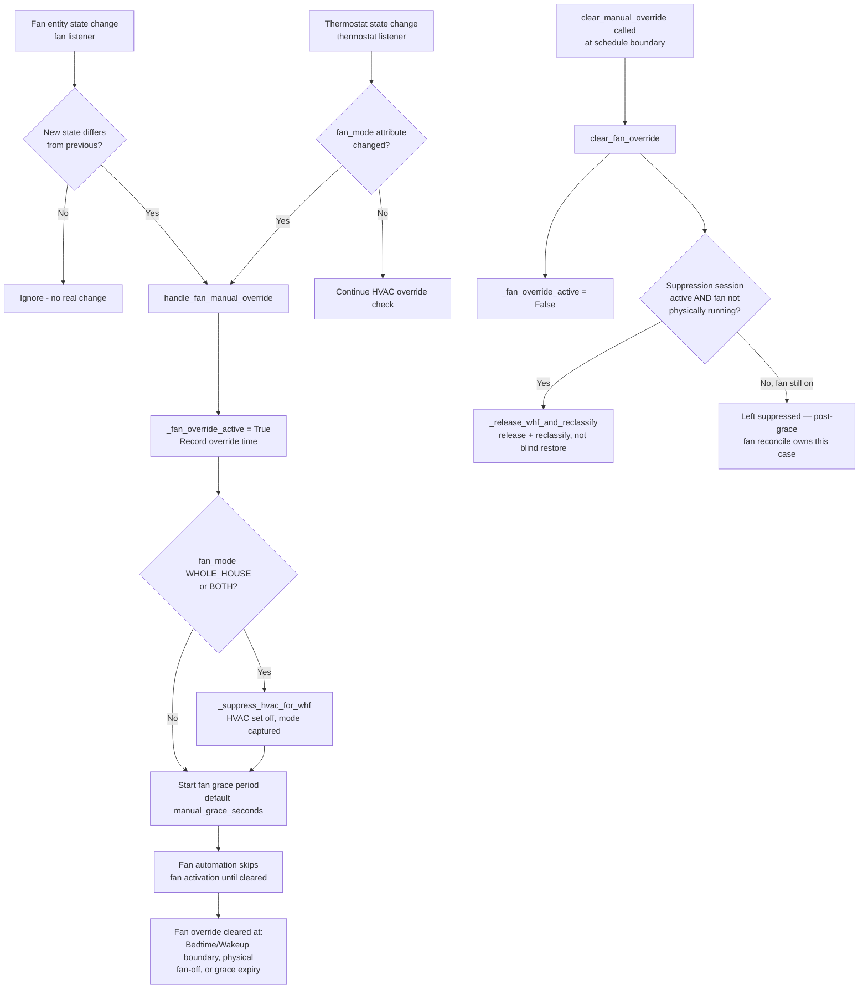
```mermaid
graph TD
    A[Fan entity state change\nfan listener] --> B{New state differs\nfrom previous?}
    B -->|No| C[Ignore - no real change]
    B -->|Yes| D[handle_fan_manual_override]

    E[Thermostat state change\nthermostat listener] --> F{fan_mode attribute\nchanged?}
    F -->|No| G[Continue HVAC override check]
    F -->|Yes| D

    D --> H[_fan_override_active = True\nRecord override time]
    H --> H2{fan_mode WHOLE_HOUSE\nor BOTH?}
    H2 -->|Yes| H3[_suppress_hvac_for_whf\nHVAC set off, mode captured]
    H2 -->|No| I
    H3 --> I[Start fan grace period\ndefault manual_grace_seconds]
    I --> J[Fan automation skips\nfan activation until cleared]
    J --> K[Fan override cleared at:\nBedtime/Wakeup boundary, physical\nfan-off, or grace expiry]

    L[clear_manual_override called\nat schedule boundary] --> M[clear_fan_override]
    M --> N[_fan_override_active = False]
    M --> O{Suppression session\nactive AND fan not\nphysically running?}
    O -->|Yes| P[_release_whf_and_reclassify\nrelease + reclassify, not blind restore]
    O -->|No, fan still on| Q[Left suppressed — post-grace\nfan reconcile owns this case]
```

`on_fan_turned_off()` (physical fan confirmed off by the triggering event) reaches the same `_release_whf_and_reclassify()` unconditionally — no physical-state re-check needed there, since the event itself confirms the fan is off.

---

## 7. Fan Behavior at Schedule Transitions

Fan and economizer state are explicitly managed at the two main daily schedule boundaries: bedtime and morning wakeup. `clear_manual_override()` calls `clear_fan_override()` internally, so both override flags are cleared together at each boundary.

**Nat-vent continuation gate (Issue #370):** At bedtime, if nat-vent is active and outdoor air is still cooler than the sleep target, the fan is allowed to continue past bedtime rather than being stopped unconditionally. Through the sleep window, `nat_vent_temperature_check()` cycles the fan on/off around the sleep-aware midpoint (`sleep_heat + hysteresis`) — this is not a session-ending exit, just normal cycling. The session only ends via `check_natural_vent_conditions()`'s comfort-floor exit (§12b), which is itself sleep-aware as of Issue #402 (floor = `sleep_heat - hysteresis` during the sleep window). The older "Priority 0 sleep-ceiling reached" exit referenced here in earlier docs was removed in Issue #371 and does not exist in current code.

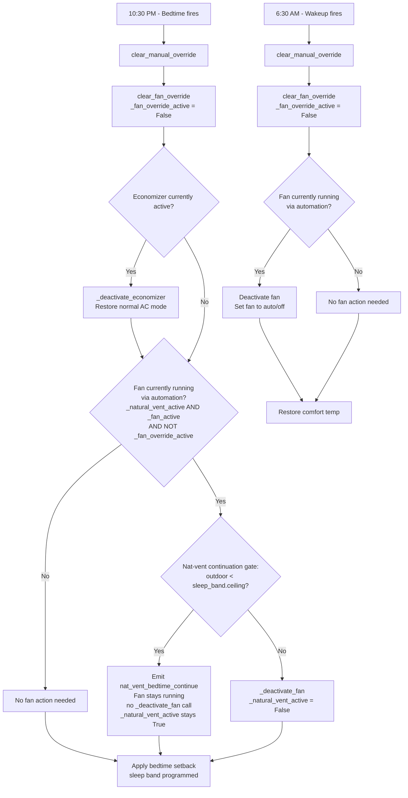
```mermaid
graph TD
    A[10:30 PM - Bedtime fires] --> B[clear_manual_override]
    B --> C[clear_fan_override\n_fan_override_active = False]
    C --> D{Economizer currently active?}
    D -->|Yes| E[_deactivate_economizer\nRestore normal AC mode]
    D -->|No| F{Fan currently running\nvia automation?\n_natural_vent_active AND _fan_active\nAND NOT _fan_override_active}
    E --> F
    F -->|No| H[No fan action needed]
    F -->|Yes| NV{Nat-vent continuation gate:\noutdoor < sleep_band.ceiling?}
    NV -->|Yes| NVC[Emit nat_vent_bedtime_continue\nFan stays running\nno _deactivate_fan call\n_natural_vent_active stays True]
    NV -->|No| G[_deactivate_fan\n_natural_vent_active = False]
    G --> I[Apply bedtime setback\nsleep band programmed]
    H --> I
    NVC --> I

    J[6:30 AM - Wakeup fires] --> K[clear_manual_override]
    K --> L[clear_fan_override\n_fan_override_active = False]
    L --> M{Fan currently running\nvia automation?}
    M -->|Yes| N[Deactivate fan\nSet fan to auto/off]
    M -->|No| O[No fan action needed]
    N --> P[Restore comfort temp]
    O --> P
```

---

## 8. Grace Period System

Two grace period types are managed by `_start_grace_period()` in `AutomationEngine`.

When any grace period expires, the system re-checks contact sensor state before resuming normal automation. If any contact sensor is still open, HVAC is re-paused immediately rather than blindly restoring normal operation. This prevents the safety issue of running heating or cooling with a door or window open.

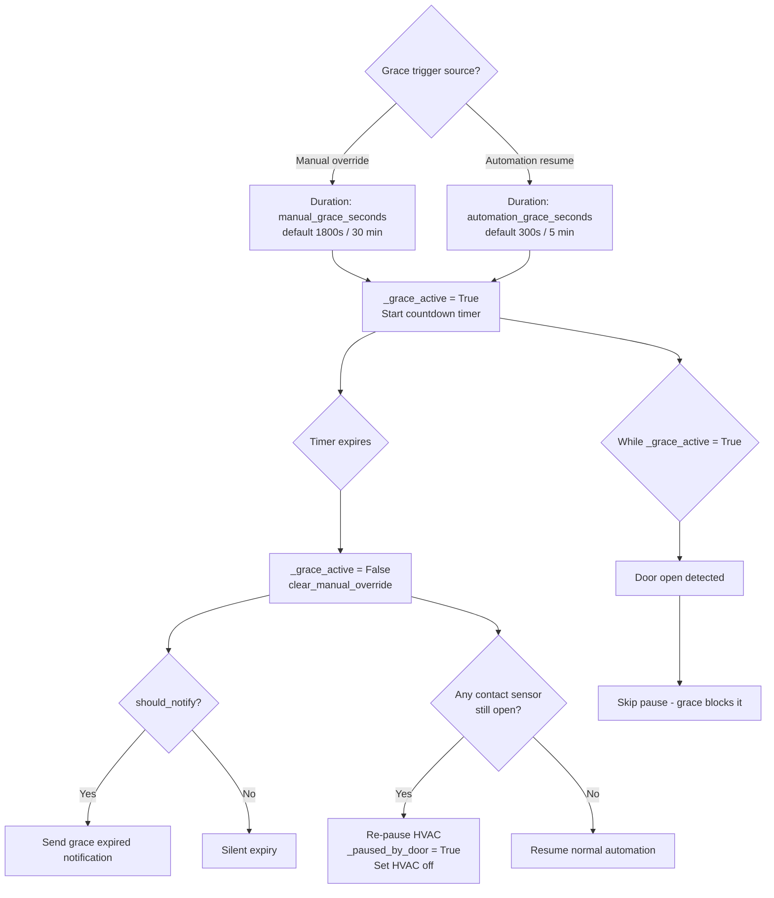
```mermaid
graph TD
    A{Grace trigger source?}
    A -->|Manual override| B[Duration: manual_grace_seconds\ndefault 1800s / 30 min]
    A -->|Automation resume| C[Duration: automation_grace_seconds\ndefault 300s / 5 min]
    B --> D[_grace_active = True\nStart countdown timer]
    C --> D
    D --> E{Timer expires}
    E --> F[_grace_active = False\nclear_manual_override]
    F --> G{should_notify?}
    G -->|Yes| H[Send grace expired notification]
    G -->|No| I[Silent expiry]
    F --> J{Any contact sensor\nstill open?}
    J -->|Yes| K[Re-pause HVAC\n_paused_by_door = True\nSet HVAC off]
    J -->|No| L[Resume normal automation]
    D --> M{While _grace_active = True}
    M --> N[Door open detected]
    N --> O[Skip pause - grace blocks it]
```

---

## 9. Occupancy State Machine

Four occupancy states with priority resolution via `_compute_occupancy_mode()` in the coordinator.

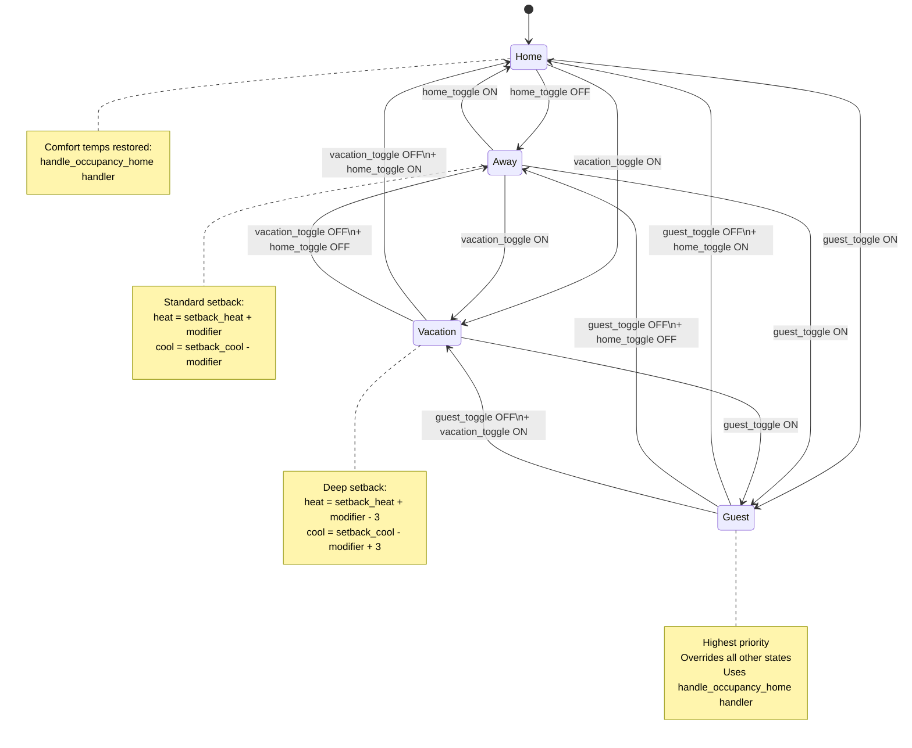
```mermaid
stateDiagram-v2
    [*] --> Home

    Home --> Away: home_toggle OFF
    Home --> Vacation: vacation_toggle ON
    Home --> Guest: guest_toggle ON

    Away --> Home: home_toggle ON
    Away --> Vacation: vacation_toggle ON
    Away --> Guest: guest_toggle ON

    Vacation --> Home: vacation_toggle OFF\n+ home_toggle ON
    Vacation --> Away: vacation_toggle OFF\n+ home_toggle OFF
    Vacation --> Guest: guest_toggle ON

    Guest --> Home: guest_toggle OFF\n+ home_toggle ON
    Guest --> Away: guest_toggle OFF\n+ home_toggle OFF
    Guest --> Vacation: guest_toggle OFF\n+ vacation_toggle ON

    note right of Guest
        Highest priority
        Overrides all other states
        Uses handle_occupancy_home handler
    end note

    note right of Vacation
        Deep setback:
        heat = setback_heat + modifier - 3
        cool = setback_cool - modifier + 3
    end note

    note right of Away
        Standard setback:
        heat = setback_heat + modifier
        cool = setback_cool - modifier
    end note

    note right of Home
        Comfort temps restored:
        handle_occupancy_home handler
    end note
```

---

## 10. Economizer — Window Cooling on Hot Days

`check_window_cooling_opportunity()` in `AutomationEngine` implements a two-phase window cooling strategy.

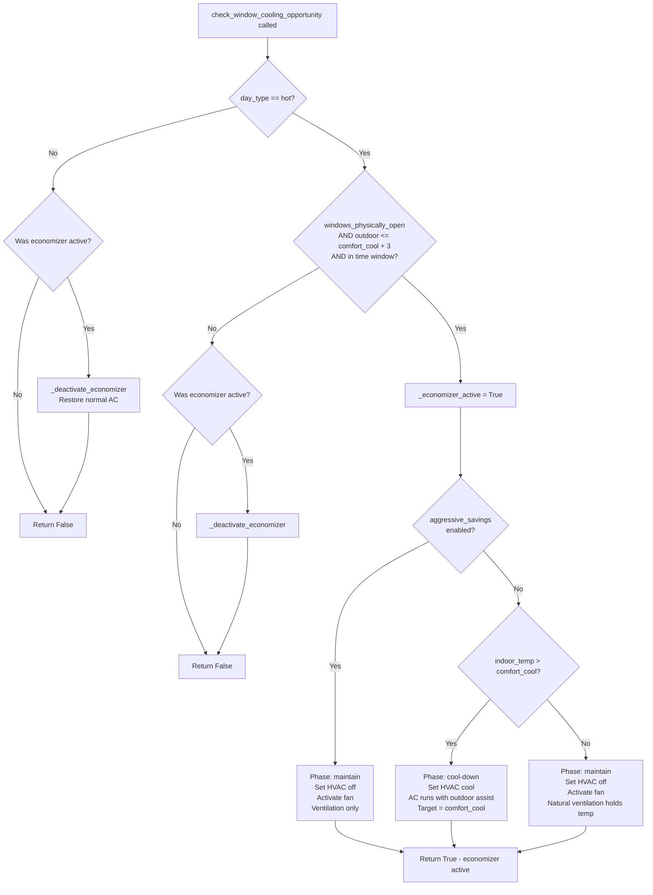
```mermaid
graph TD
    A[check_window_cooling_opportunity called] --> B{day_type == hot?}
    B -->|No| C{Was economizer active?}
    C -->|Yes| D[_deactivate_economizer\nRestore normal AC]
    C -->|No| E[Return False]
    D --> E
    B -->|Yes| F{windows_physically_open\nAND outdoor <= comfort_cool + 3\nAND in time window?}
    F -->|No| G{Was economizer active?}
    G -->|Yes| H[_deactivate_economizer]
    G -->|No| I[Return False]
    H --> I
    F -->|Yes| J[_economizer_active = True]
    J --> K{aggressive_savings\nenabled?}
    K -->|Yes| L[Phase: maintain\nSet HVAC off\nActivate fan\nVentilation only]
    K -->|No| M{indoor_temp > comfort_cool?}
    M -->|Yes| N[Phase: cool-down\nSet HVAC cool\nAC runs with outdoor assist\nTarget = comfort_cool]
    M -->|No| O[Phase: maintain\nSet HVAC off\nActivate fan\nNatural ventilation holds temp]
    L --> P[Return True - economizer active]
    N --> P
    O --> P
```

Time window check: morning 6:00–9:00 AM or evening 5:00 PM–midnight.

---

## 11. Startup Safety

First-run logic and weather entity backoff handled in `_async_update_data()`.

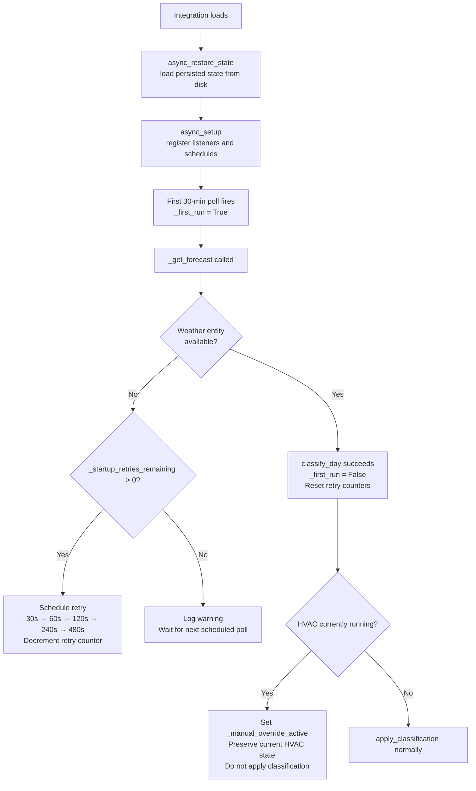
```mermaid
graph TD
    A[Integration loads] --> B[async_restore_state\nload persisted state from disk]
    B --> C[async_setup\nregister listeners and schedules]
    C --> D[First 30-min poll fires\n_first_run = True]
    D --> E[_get_forecast called]
    E --> F{Weather entity\navailable?}
    F -->|No| G{_startup_retries_remaining > 0?}
    G -->|Yes| H[Schedule retry\n30s → 60s → 120s → 240s → 480s\nDecrement retry counter]
    G -->|No| I[Log warning\nWait for next scheduled poll]
    F -->|Yes| J[classify_day succeeds\n_first_run = False\nReset retry counters]
    J --> K{HVAC currently running?}
    K -->|Yes| L[Set _manual_override_active\nPreserve current HVAC state\nDo not apply classification]
    K -->|No| M[apply_classification normally]
```

---

## 12. Natural Ventilation Decision Flow

`check_natural_vent_conditions()` in `AutomationEngine` implements continuous monitoring. Initial activation fires from `handle_door_window_open()` when a contact sensor opens and the system is not already in a planned window period or grace period.

### 12a. Activation on Sensor Open

When a contact sensor opens (after debounce), the automation engine checks whether natural ventilation conditions are met before deciding how to respond.

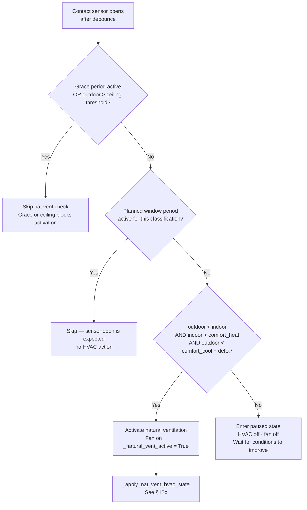
```mermaid
flowchart TD
    A[Contact sensor opens\nafter debounce] --> B{Grace period active\nOR outdoor > ceiling threshold?}
    B -->|Yes| C[Skip nat vent check\nGrace or ceiling blocks activation]
    B -->|No| D{Planned window period\nactive for this classification?}
    D -->|Yes| E[Skip — sensor open is expected\nno HVAC action]
    D -->|No| F{outdoor < indoor\nAND indoor > comfort_heat\nAND outdoor < comfort_cool + delta?}
    F -->|Yes| G[Activate natural ventilation\nFan on · _natural_vent_active = True]
    G --> G2[_apply_nat_vent_hvac_state\nSee §12c]
    F -->|No| H[Enter paused state\nHVAC off · fan off\nWait for conditions to improve]
```

### 12b. Continuous Monitoring (`check_natural_vent_conditions`)

This check runs on every coordinator update while nat vent is active or paused. Exit conditions are evaluated in priority order; the first match wins.

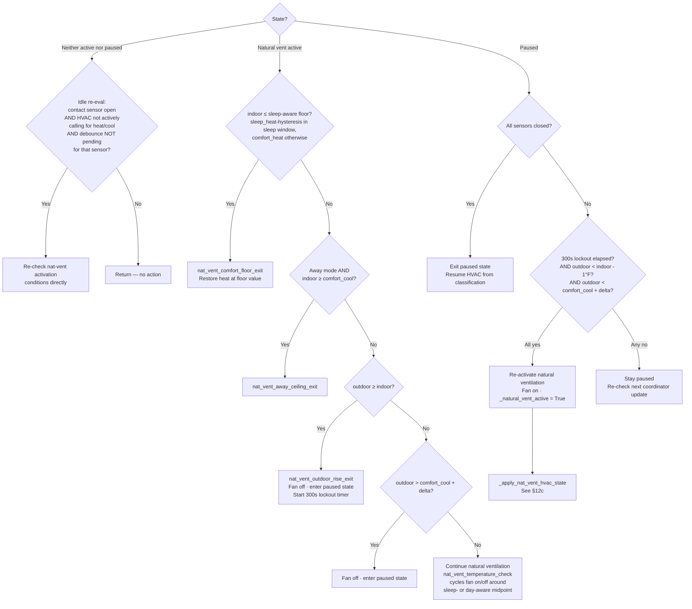
```mermaid
flowchart TD
    A{State?} -->|Neither active nor paused| A2{Idle re-eval:\ncontact sensor open\nAND HVAC not actively\ncalling for heat/cool\nAND debounce NOT pending\nfor that sensor?}
    A2 -->|Yes| A3[Re-check nat-vent activation\nconditions directly]
    A2 -->|No| Z[Return — no action]
    A -->|Natural vent active| D{indoor ≤ sleep-aware floor?\nsleep_heat-hysteresis in sleep window,\ncomfort_heat otherwise}
    D -->|Yes| E[nat_vent_comfort_floor_exit\nRestore heat at floor value]
    D -->|No| B2{Away mode AND\nindoor ≥ comfort_cool?}
    B2 -->|Yes| C2[nat_vent_away_ceiling_exit]
    B2 -->|No| F{outdoor ≥ indoor?}
    F -->|Yes| G[nat_vent_outdoor_rise_exit\nFan off · enter paused state\nStart 300s lockout timer]
    F -->|No| H{outdoor > comfort_cool + delta?}
    H -->|Yes| I[Fan off · enter paused state]
    H -->|No| J[Continue natural ventilation\nnat_vent_temperature_check\ncycles fan on/off around\nsleep- or day-aware midpoint]
    A -->|Paused| K{All sensors closed?}
    K -->|Yes| L[Exit paused state\nResume HVAC from classification]
    K -->|No| M{300s lockout elapsed?\nAND outdoor < indoor - 1°F?\nAND outdoor < comfort_cool + delta?}
    M -->|All yes| N[Re-activate natural ventilation\nFan on · _natural_vent_active = True]
    N --> N2[_apply_nat_vent_hvac_state\nSee §12c]
    M -->|Any no| O[Stay paused\nRe-check next coordinator update]
```

**Comfort-floor exit note (Issue #402):** The floor is sleep-aware — `sleep_heat - hysteresis` during the sleep window, `comfort_heat` otherwise — mirroring `nat_vent_temperature_check()`'s cycling thresholds so the two don't fight each other. `fan_thermostat_check()` (the separate, more frequent tick-level safety check called on every thermostat temperature change) implements the same sleep-aware floor as of Issue #402; previously it hardcoded `comfort_heat` unconditionally and — because it fires far more often than this 30-min-cycle function — always preempted the sleep-window cycling before it could ever run, permanently ending nat-vent sessions at `comfort_heat` instead of letting them cycle through the night.

**Idle re-eval note (Issue #244, gate widened in #402, debounce-gated in #504):** When neither active nor paused, a contact sensor left open with the thermostat not actively calling for heat/cool re-triggers a direct nat-vent activation check — this is what lets the occupant catch free evening/overnight cooling without waiting for a sensor state-change event. Originally this required the thermostat's armed *mode* to be literally `"off"`; as of Issue #402 it checks `hvac_action` (idle/off) instead, because `_apply_comfort_band()` legitimately arms `cool` mode as a ceiling backstop once nat-vent releases HVAC ownership, and that backstop was permanently blocking this re-evaluation path even when the compressor was never actually running. As of Issue #504, this path also requires that no currently-open monitored sensor still has a pending `CONF_SENSOR_DEBOUNCE` timer (checked via the coordinator's `_sensor_debounce_pending_callback`, reusing `_door_open_timers`) — previously it reacted to the sensor's raw instantaneous state with zero settle time, which let a rapidly bouncing/flaky sensor snap the fan on and back off within seconds. Issue #244's own scenario (a sensor open long past any debounce window) is unaffected, since that timer has long since resolved by the time it matters.

**Hysteresis note:** The 1°F gap in the re-activation check (`outdoor < indoor - 1°F`) and the 300-second lockout timer together prevent rapid oscillation when outdoor and indoor temperatures are near equilibrium. Without both guards, a small thermal fluctuation could toggle nat vent on and off multiple times within a single hour.

**Sensor-close on warm/mild day (Fix #338):** When all sensors close while nat-vent is active on a warm or mild day (nodes `B → C`), `handle_all_doors_windows_closed()` now re-arms the comfort band immediately via `_apply_nat_vent_hvac_state()`'s inverse — restoring the full `[comfort_heat, comfort_cool]` comfort band at the moment of close. Previously the warm/mild path skipped the re-arm (the `if c.hvac_mode in ("heat", "cool")` check failed for the `"off"` classifier label), leaving the thermostat without an armed ceiling until the next 30-minute `apply_classification()` cycle — a gap of up to 30 minutes.

---

### 12c. Nat-Vent HVAC State — `_apply_nat_vent_hvac_state()`

`_apply_nat_vent_hvac_state()` is called at every nat-vent activation site (initial sensor-open activation in §12a and re-activation from paused state in §12b) and is enforced in `apply_classification()`. It decides what HVAC band to arm alongside the running fan, based on the configured fan archetype and `aggressive_savings` setting.

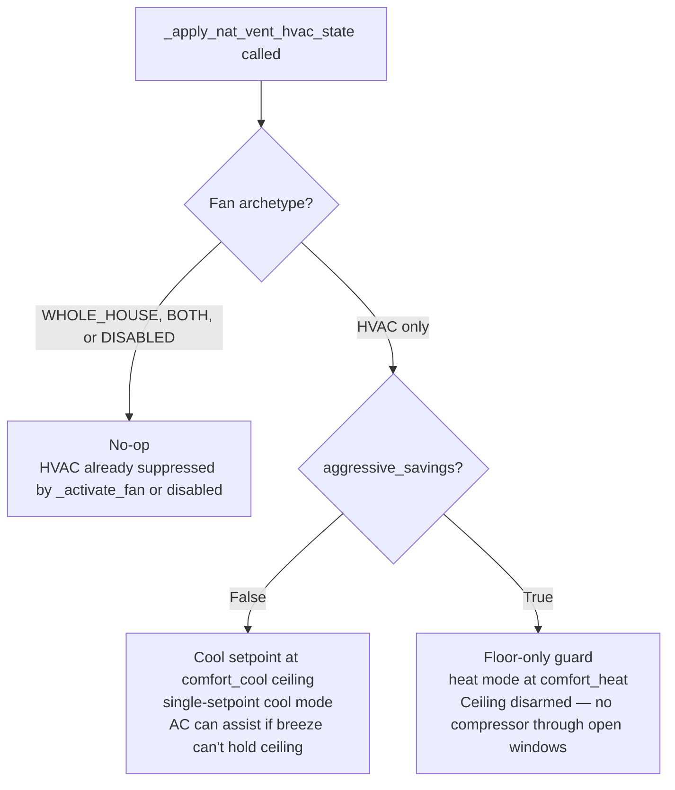
```mermaid
flowchart TD
    A[_apply_nat_vent_hvac_state called] --> B{Fan archetype?}
    B -->|WHOLE_HOUSE, BOTH, or DISABLED| C[No-op\nHVAC already suppressed by _activate_fan or disabled]
    B -->|HVAC only| D{aggressive_savings?}
    D -->|False| E[Cool setpoint at comfort_cool ceiling\nsingle-setpoint cool mode\nAC can assist if breeze can't hold ceiling]
    D -->|True| F[Floor-only guard\nheat mode at comfort_heat\nCeiling disarmed — no compressor through open windows]
```

**Note (v0.4.72, Issue #424):** `BOTH` is a legacy/internal-only value as of v0.4.72 — it is no longer selectable in setup or options (existing `"both"` configs migrate to `FAN_MODE_WHOLE_HOUSE` on load). The `BOTH` branch above remains in the code and this diagram only because the branch logic was intentionally left in place, not because users can still choose it.

**Why this matters for the occupant:**
- `FAN_MODE_WHOLE_HOUSE`/`DISABLED`: the HVAC is already suppressed by the fan activation path; no further band arming is needed.
- `FAN_MODE_HVAC` + `aggressive_savings=False`: a single cool setpoint at `comfort_cool` is programmed immediately on nat-vent activate (or re-activate). The thermostat can run the compressor if the breeze cannot hold the ceiling. The floor (`comfort_heat`) is not re-armed by this call — it remains enforced by the existing 30-min `apply_classification()` warm-day band cycle.
- `FAN_MODE_HVAC` + `aggressive_savings=True`: only the heat floor is armed (heat mode @ `comfort_heat`); the cool ceiling is intentionally disarmed. Running the compressor through open windows defeats the energy savings the user asked for — if the breeze cannot hold the ceiling, the occupant accepts it.

**Call sites:** `handle_door_window_open()` (§12a activation), `check_natural_vent_conditions()` (§12b re-activate from paused state), and `apply_classification()` (30-minute cycle — enforces band state every cycle while nat-vent is active).

---

## 13. Warm-Day `apply_classification()` Guard Sequence

On every 30-minute coordinator update, `apply_classification()` runs two sequential guards before executing the `warm` or `mild` classification's default HVAC-off action. The guards run in order; the second guard only evaluates if the first does not fire.

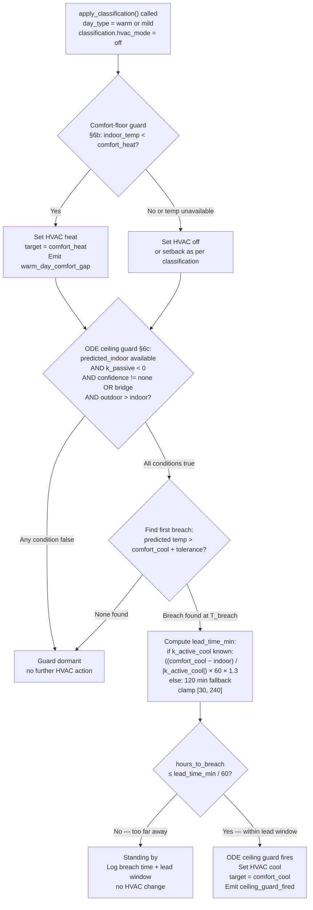
```mermaid
flowchart TD
    A["apply_classification() called\nday_type = warm or mild\nclassification.hvac_mode = off"] --> B{Comfort-floor guard\n§6b: indoor_temp < comfort_heat?}
    B -->|Yes| C[Set HVAC heat\ntarget = comfort_heat\nEmit warm_day_comfort_gap]
    B -->|No or temp unavailable| E[Set HVAC off\nor setback as per classification]
    C --> D
    E --> D
    D{ODE ceiling guard §6c:\npredicted_indoor available\nAND k_passive < 0\nAND confidence != none OR bridge\nAND outdoor > indoor?} -->|Any condition false| Z[Guard dormant\nno further HVAC action]
    D -->|All conditions true| F{Find first breach:\npredicted temp > comfort_cool + tolerance?}
    F -->|None found| Z
    F -->|Breach found at T_breach| G["Compute lead_time_min:\nif k_active_cool known:\n  ((comfort_cool − indoor) / |k_active_cool|) × 60 × 1.3\nelse: 120 min fallback\nclamp [30, 240]"]
    G --> H{"hours_to_breach\n≤ lead_time_min / 60?"}
    H -->|No — too far away| I[Standing by\nLog breach time + lead window\nno HVAC change]
    H -->|Yes — within lead window| J[ODE ceiling guard fires\nSet HVAC cool\ntarget = comfort_cool\nEmit ceiling_guard_fired]
```

**Guard order:** The comfort-floor guard runs first inside the `hvac_mode == "off"` branch. The ceiling guard runs afterward as a separate block, still gated by `classification.hvac_mode == "off"`. In practice the two guards do not conflict: if indoor is below `comfort_heat` (floor guard fires), outdoor is typically also cool, so `outdoor <= indoor` causes the ceiling guard to go dormant on the same cycle.

**Stateless design:** Neither guard uses a flag or scheduled callback. Each 30-min cycle re-evaluates from the latest ODE curve and current sensor readings. If the forecast improves (predicted breach disappears), the ceiling guard goes dormant automatically on the next cycle without any cancellation logic.

**Bridge homes** (`k_passive_via_bridge=True`): the ceiling guard scans for `temp > comfort_cool + 1.0°F` (tolerance = `CEILING_BRIDGE_TOLERANCE_F`). Standard homes use tolerance = 0.0.

**`k_active_cool = None`** (first cooling season, any home): the 120-min fallback replaces the lead-time formula. This is the normal case for new installs and all homes before their first cooling cycle is learned.

For the complete guard condition table, lead-time formula derivation, and bridge/occupancy interactions, see [§6c in the Computation Reference](08-COMPUTATION-REFERENCE.md#6c-warm-day-ode-ceiling-guard-issue-136).

---

---

## 14. Fan Startup Reconciliation and Thermostatic Loop (Issue #327)

### 14a. Startup Coalesce Fan Reconcile (`reconcile_fan_on_startup`)

After the existing nat-vent / `apply_classification` logic in `_do_startup_coalesce`, a fan reconcile step reads the thermostat's live `fan_mode` and `hvac_action` and decides the correct ownership state. `_fan_override_active` is always cleared before this step (clean slate — §9e Fix A).

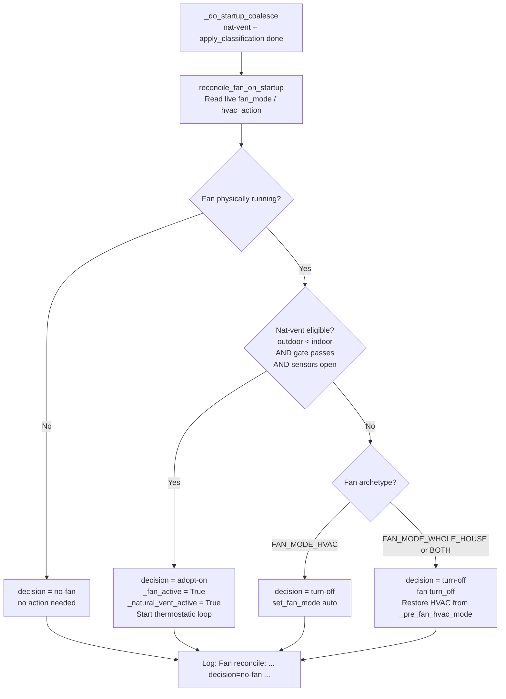
```mermaid
flowchart TD
    A[_do_startup_coalesce\nnat-vent + apply_classification done] --> B[reconcile_fan_on_startup\nRead live fan_mode / hvac_action]
    B --> C{Fan physically running?}
    C -->|No| D[decision = no-fan\nno action needed]
    C -->|Yes| E{Nat-vent eligible?\noutdoor < indoor\nAND gate passes\nAND sensors open}
    E -->|Yes| F[decision = adopt-on\n_fan_active = True\n_natural_vent_active = True\nStart thermostatic loop]
    E -->|No| G{Fan archetype?}
    G -->|FAN_MODE_HVAC| H[decision = turn-off\nset_fan_mode auto]
    G -->|FAN_MODE_WHOLE_HOUSE or BOTH| I[decision = turn-off\nfan turn_off\nRestore HVAC from _pre_fan_hvac_mode]
    D --> J[Log: Fan reconcile: ... decision=no-fan ...]
    F --> J
    H --> J
    I --> J
```

**Note (v0.4.72, Issue #424):** `BOTH` is a legacy/internal-only value as of v0.4.72 — it is no longer selectable in setup or options (existing `"both"` configs migrate to `FAN_MODE_WHOLE_HOUSE` on load). The `BOTH` branch above remains in the code and this diagram only because the branch logic was intentionally left in place, not because users can still choose it.

**Key invariants:**
- The coalesce window (`_first_run = True`, 5-minute settling) suppresses override detection — the turn-off command is not misread as a user manual action.
- Log line `Fan reconcile: thermostat fan_mode=<x> hvac_action=<y> nat_vent_eligible=<bool> decision=<adopt-on|turn-off|no-fan> archetype=<mode>` is the post-deploy validation grep target.

### 14b. Thermostatic Fan Loop Trigger Sources

`fan_thermostat_check(indoor, outdoor, trigger)` fires on every temperature change from three independent sources simultaneously, whenever `_fan_active=True`.

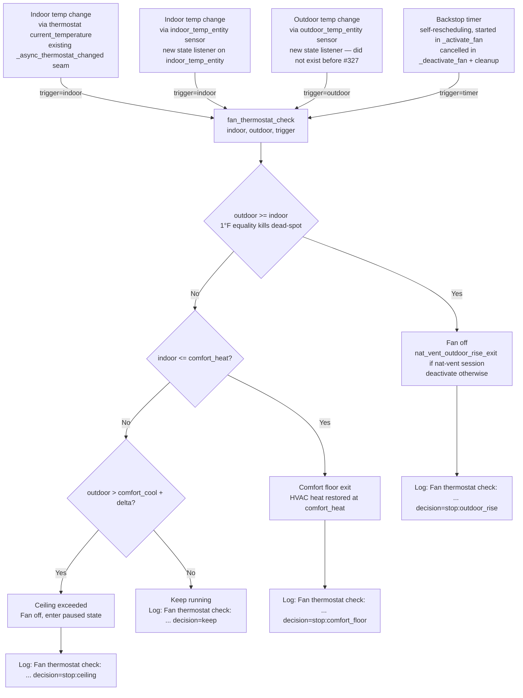
```mermaid
flowchart TD
    A1[Indoor temp change\nvia thermostat current_temperature\nexisting _async_thermostat_changed seam] -->|trigger=indoor| T
    A2[Indoor temp change\nvia indoor_temp_entity sensor\nnew state listener on indoor_temp_entity] -->|trigger=indoor| T
    A3[Outdoor temp change\nvia outdoor_temp_entity sensor\nnew state listener — did not exist before #327] -->|trigger=outdoor| T
    A4[Backstop timer\nself-rescheduling, started in _activate_fan\ncancelled in _deactivate_fan + cleanup] -->|trigger=timer| T

    T[fan_thermostat_check\nindoor, outdoor, trigger]
    T --> E1{outdoor >= indoor\n1°F equality kills dead-spot}
    E1 -->|Yes| X1[Fan off\nnat_vent_outdoor_rise_exit if nat-vent session\ndeactivate otherwise]
    E1 -->|No| E2{indoor <= comfort_heat?}
    E2 -->|Yes| X2[Comfort floor exit\nHVAC heat restored at comfort_heat]
    E2 -->|No| E3{outdoor > comfort_cool + delta?}
    E3 -->|Yes| X3[Ceiling exceeded\nFan off, enter paused state]
    E3 -->|No| K[Keep running\nLog: Fan thermostat check: ... decision=keep]
    X1 --> L[Log: Fan thermostat check: ... decision=stop:outdoor_rise]
    X2 --> L2[Log: Fan thermostat check: ... decision=stop:comfort_floor]
    X3 --> L3[Log: Fan thermostat check: ... decision=stop:ceiling]
```

**Contrast with pre-#327 behavior:** Before Issue #327, nat-vent used `nat_vent_temperature_check` which fired only on thermostat temperature ticks, checked comfort-floor and cycling but not `outdoor ≥ indoor`, and had no outdoor sensor listener. The outdoor temperature rise was invisible until the next 30-minute coordinator poll — a gap of up to 29 minutes during which the fan could run with warmer outdoor air entering the home.

**Listener registration:** On coordinator setup, one INFO line confirms all three entity listeners are active:
```
Fan control: watching indoor=<entity> outdoor=<entity> thermostat=<entity> for thermostatic re-eval
```

### 14c. Fan-ON Eligibility Check (Issue #359)

When the user turns the fan on manually, `_async_thermostat_changed()` / `_async_fan_entity_changed()` evaluates nat-vent eligibility before deciding whether to adopt the session or record a manual override.

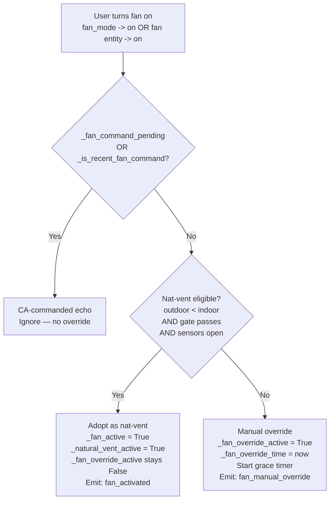
```mermaid
flowchart TD
    A[User turns fan on\nfan_mode -> on OR fan entity -> on] --> B{_fan_command_pending\nOR _is_recent_fan_command?}
    B -->|Yes| Z[CA-commanded echo\nIgnore — no override]
    B -->|No| C{Nat-vent eligible?\noutdoor < indoor\nAND gate passes\nAND sensors open}
    C -->|Yes| D[Adopt as nat-vent\n_fan_active = True\n_natural_vent_active = True\n_fan_override_active stays False\nEmit: fan_activated]
    C -->|No| E[Manual override\n_fan_override_active = True\n_fan_override_time = now\nStart grace timer\nEmit: fan_manual_override]
```

### 14d. Fan-OFF by User: `on_fan_turned_off()` (Issue #359)

When the user physically turns the fan off (thermostat or fan entity reports fan_mode → auto while CA owns the fan OR `_fan_override_active` is set), `on_fan_turned_off()` handles the transition. This is distinct from `_deactivate_fan()` (CA-initiated) and from `nat_vent_fan_off` (which is an HVAC arming-state change, not a physical fan stop).

```mermaid
flowchart TD
    A[User turns fan off\nfan_mode -> auto OR fan entity -> off\nwhile _fan_active OR _fan_override_active] --> B[on_fan_turned_off\nClear _fan_active\nClear _natural_vent_active\n_fan_override_active stays False\nEmit: fan_cancel]
    B --> C{Ecobee setpoint echo?\nSetpoint attr changed\nwithin 5 s of fan-off}
    C -->|Yes| D[Suppress setpoint\n_setpoint_reassert_pending = True\nSchedule 5 s re-assert callback]
    C -->|No| E[Normal flow continues]
    B --> F[Start fan-off grace timer\nGates nat-vent RE-ACTIVATION\nnot CA interference]
    F --> G{Grace expires}
    G --> H[reconcile_fan_on_startup\nRe-evaluate physical state]
    H --> I{Fan still physically running?}
    I -->|No| J[Confirm fan is off\nno action]
    I -->|Yes, eligible| K[Adopt-on\nnat-vent resumes]
    I -->|Yes, ineligible| L[Turn off\n_deactivate_fan]
```

**Key semantic distinction:** The `fan_off` grace gates nat-vent **re-activation** (CA backs off from restarting the fan the user just stopped). The `fan_manual_override` grace (§9b) gates CA **interference** with a fan the user is running. See `docs/grace-periods-spec.md` for the full state machine.

---

*Last Updated: 2026-06-29*
